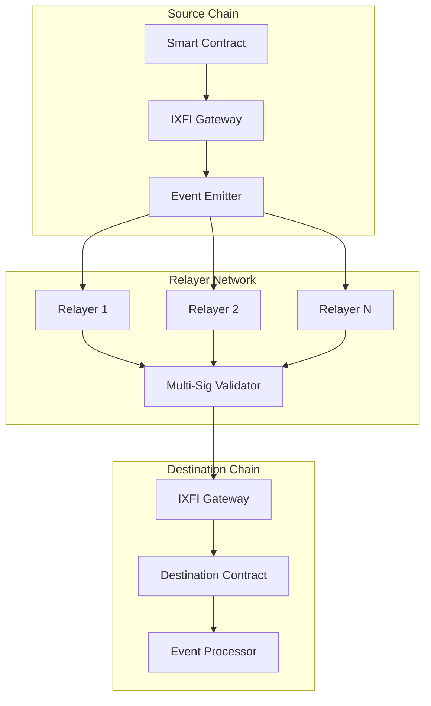
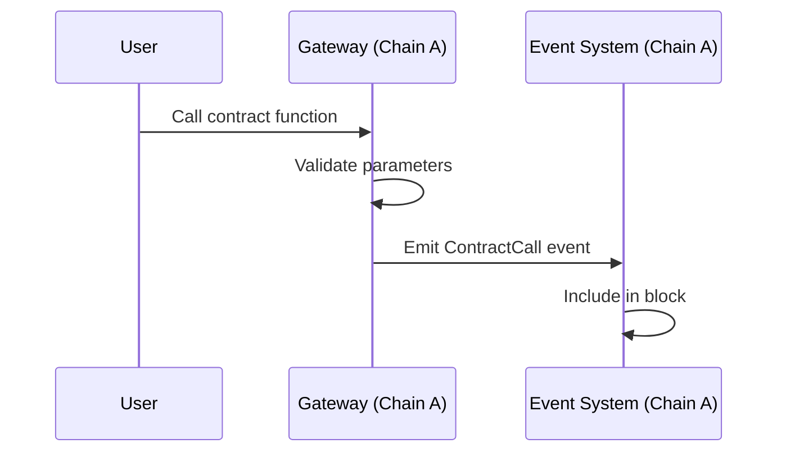
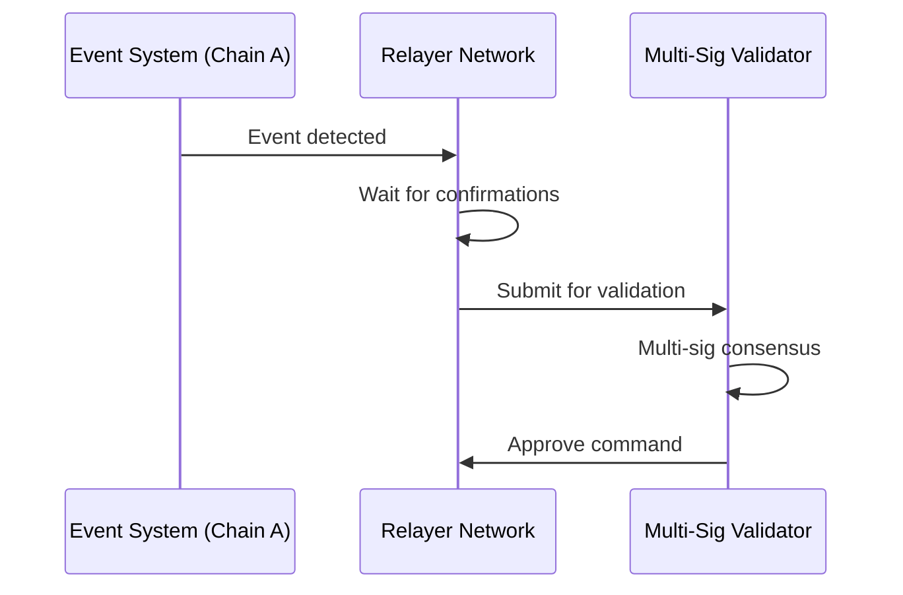
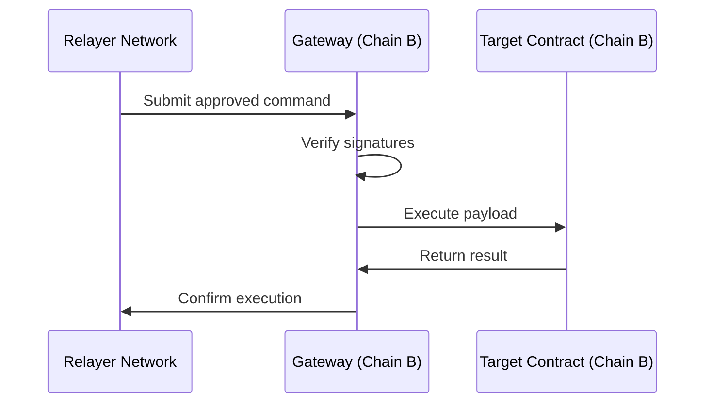
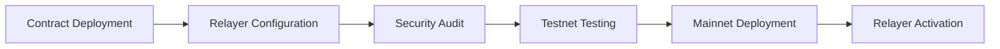

# Cross-Chain Architecture

IXFI Protocol implements a robust cross-chain architecture that enables seamless interoperability between different blockchain networks while maintaining security and decentralization.

## Architecture Overview



## Core Components

### 1. IXFI Gateway

The gateway contract serves as the primary interface for cross-chain operations:

- **Event Emission**: Captures and emits cross-chain transaction events
- **Command Validation**: Validates incoming cross-chain commands
- **Security Enforcement**: Implements multi-signature and replay protection
- **State Management**: Maintains cross-chain state synchronization

### 2. Relayer Network

A decentralized network of validators that process cross-chain messages:

- **Event Monitoring**: Continuously monitors source chain events
- **Message Relaying**: Securely transmits messages between chains
- **Consensus Mechanism**: Multi-signature validation for security
- **Finality Confirmation**: Waits for block confirmations before processing

### 3. Command System

Standardized command types for different operations:

```solidity
// Core command types
uint256 COMMAND_APPROVE_CONTRACT_CALL = 0;
uint256 COMMAND_APPROVE_CONTRACT_CALL_WITH_MINT = 1;
uint256 COMMAND_BURN_TOKEN = 2;
uint256 COMMAND_MINT_TOKEN = 4;
```

## Cross-Chain Message Flow

### 1. Message Initiation



### 2. Relayer Processing



### 3. Message Execution



## Security Architecture

### Multi-Signature Validation

The protocol employs a robust multi-signature scheme:

```solidity
struct Command {
    uint256 commandType;
    bytes data;
    bytes32[] signatures;
    uint256 threshold;
}

function validateCommand(Command memory cmd) internal view returns (bool) {
    require(cmd.signatures.length >= cmd.threshold, "Insufficient signatures");
    // Validate each signature against authorized relayers
    return true;
}
```

### Key Security Features

1. **Signature Verification**: All cross-chain commands require valid signatures
2. **Replay Protection**: Command IDs prevent duplicate execution
3. **Threshold Security**: Configurable signature thresholds
4. **Relayer Rotation**: Dynamic relayer set management
5. **Emergency Pause**: Circuit breakers for security incidents

### Threat Mitigation

| Threat | Mitigation Strategy |
|--------|-------------------|
| Relayer Compromise | Multi-signature threshold voting |
| Replay Attacks | Unique command IDs and nonce tracking |
| Front-running | Commit-reveal schemes where applicable |
| MEV Exploitation | Fair ordering mechanisms |
| Chain Reorganization | Deep confirmation requirements |

## Chain Integration Process

### 1. Technical Requirements

New chain integration requires:

- **EVM Compatibility**: Smart contract deployment capability
- **Event System**: Reliable event emission and querying
- **RPC Access**: Stable RPC endpoints for relayers
- **Block Finality**: Deterministic finality mechanisms

### 2. Deployment Process



### 3. Configuration Parameters

```javascript
// Chain configuration example
const chainConfig = {
    chainId: 1,
    name: "ethereum",
    rpc: "https://mainnet.infura.io/v3/...",
    gasLimit: 500000,
    blockConfirmations: 12,
    contracts: {
        gateway: "0x...",
        token: "0x..."
    }
};
```

## Performance Characteristics

### Latency Metrics

| Operation | Average Time | Factors |
|-----------|-------------|---------|
| Event Detection | 1-3 blocks | Chain block time |
| Relayer Processing | 30-60 seconds | Confirmation requirements |
| Command Execution | 1-2 blocks | Destination chain congestion |
| End-to-End | 2-5 minutes | Combined factors |

### Throughput Capacity

- **Theoretical Max**: 1000 TPS (limited by slowest chain)
- **Practical Throughput**: 100-500 TPS
- **Batching Support**: Multiple commands per transaction
- **Parallel Processing**: Independent relayer operation

## Gas Optimization

### Efficient Command Encoding

```solidity
// Optimized command structure
struct CompactCommand {
    uint8 commandType;      // 1 byte
    bytes20 target;         // 20 bytes  
    uint256 value;          // 32 bytes
    bytes data;             // Variable length
}
```

### Batch Operations

```solidity
// Execute multiple commands in single transaction
function executeBatch(CompactCommand[] memory commands) external {
    for (uint i = 0; i < commands.length; i++) {
        _executeCommand(commands[i]);
    }
}
```

## Monitoring and Analytics

### Event Tracking

The protocol provides comprehensive event tracking:

```solidity
event CrossChainCall(
    bytes32 indexed commandId,
    string indexed sourceChain,
    string indexed destinationChain,
    address sender,
    bytes payload
);

event CommandExecuted(
    bytes32 indexed commandId,
    bool success,
    bytes returnData
);
```

### Metrics Dashboard

Key metrics monitored:

- Cross-chain transaction volume
- Average execution time
- Success/failure rates  
- Relayer performance
- Gas consumption patterns

## Error Handling

### Failure Scenarios

1. **Network Partitions**: Automatic retry mechanisms
2. **Invalid Commands**: Graceful rejection with detailed errors
3. **Gas Limit Exceeded**: Dynamic gas estimation
4. **Relayer Unavailability**: Redundant relayer selection

### Recovery Mechanisms

```solidity
// Manual command retry for failed transactions
function retryCommand(bytes32 commandId) external onlyOwner {
    require(!commandExecuted[commandId], "Already executed");
    // Re-attempt execution with updated parameters
}
```

## Future Enhancements

### Planned Improvements

1. **Zero-Knowledge Proofs**: Enhanced privacy for cross-chain operations
2. **Optimistic Execution**: Faster finality with fraud proofs
3. **Cross-Chain DEX**: Native cross-chain trading without bridging
4. **Advanced Governance**: Chain-specific governance mechanisms

### Research Areas

- **Interoperability Standards**: Adoption of emerging cross-chain standards
- **Scalability Solutions**: Layer 2 integration and parallel processing
- **Security Enhancements**: Formal verification and automated auditing
- **User Experience**: Simplified interfaces and gasless transactions

## Integration Guidelines

### For Developers

1. **Contract Integration**: Implement `IXFIExecutable` interface
2. **Event Handling**: Properly handle asynchronous execution
3. **Error Management**: Implement robust error handling
4. **Testing**: Comprehensive testing across all supported chains

### For Relayers

1. **Infrastructure**: Reliable RPC access and monitoring
2. **Security**: Secure key management and HSM integration
3. **Performance**: Optimized event processing and batching
4. **Compliance**: Adherence to relayer network policies

## Resources

- [Message Passing Guide](../cross-chain/message-passing.md)
- [Token Transfer Implementation](../cross-chain/token-transfers.md)
- [Security Best Practices](../guides/security.md)
- [Relayer Network Details](relayer-network.md)
