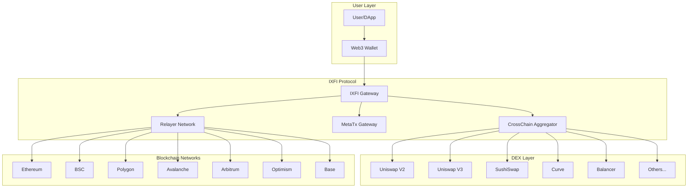
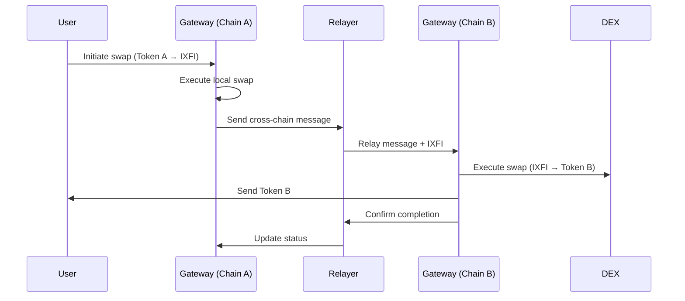
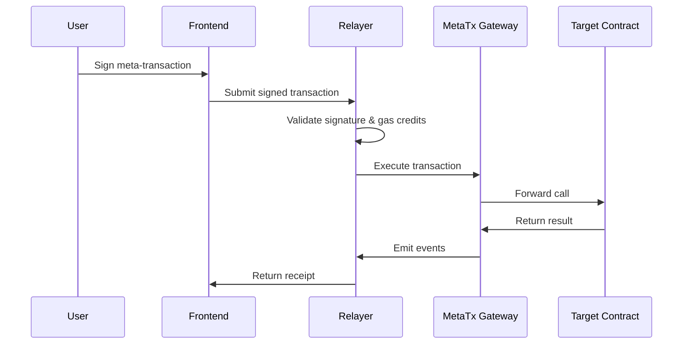

# Protocol Overview

IXFI Protocol is a comprehensive cross-chain infrastructure that enables seamless token transfers, DEX aggregation, and gasless transactions across multiple blockchain networks.

## Core Architecture

## Key Components

### 1. IXFI Gateway
The central hub for all cross-chain operations:

- **XFI ↔ IXFI Conversion**: 1:1 backing mechanism on CrossFi chain
- **Message Passing**: Cross-chain communication protocol
- **Token Bridging**: Secure token transfers between chains
- **Relayer Management**: Coordination of decentralized relayers

**Key Features:**
- ✅ Fully collateralized backing
- ✅ Decentralized validation
- ✅ Emergency pause mechanisms
- ✅ Upgrade governance

### 2. CrossChain Aggregator
Advanced DEX aggregation system supporting 37+ protocols:

- **Multi-Protocol Routing**: Optimal path finding across DEXes
- **Price Discovery**: Real-time quote comparison
- **Cross-Chain Swaps**: A→IXFI→B token swaps across chains
- **Slippage Protection**: Automated price impact management

**Supported Protocols:**
- **V2 AMMs**: Uniswap V2, SushiSwap V2, PancakeSwap V2, QuickSwap
- **V3 Concentrated Liquidity**: Uniswap V3, SushiSwap V3, PancakeSwap V3
- **Stableswap**: Curve Finance, Ellipsis Finance
- **Weighted Pools**: Balancer V2
- **Solidly Forks**: Velodrome, Aerodrome, Thena

### 3. Meta-Transaction System
Gasless transaction execution infrastructure:

- **Gas Credit Vault**: IXFI-based gas payment system
- **Signature Validation**: EIP-712 meta-transaction support
- **Relayer Coordination**: Distributed transaction execution
- **Cost Optimization**: Dynamic gas price management

### 4. Relayer Network
Decentralized infrastructure for cross-chain operations:

- **Whitelisted Relayers**: Vetted operator network
- **Consensus Mechanism**: Multi-signature validation
- **Monitoring & Alerts**: Real-time system health tracking
- **Incentive Alignment**: Fee-based compensation model

## Protocol Flow

### Standard Cross-Chain Swap

### Meta-Transaction Flow

## Security Model

### Multi-Layer Security

1. **Smart Contract Security**
   - Formal verification for critical functions
   - Multiple audit rounds
   - Bug bounty programs
   - Gradual deployment strategy

2. **Operational Security**
   - Multi-signature governance
   - Time-locked upgrades
   - Emergency pause mechanisms
   - Relayer reputation system

3. **Economic Security**
   - Full collateralization (1:1 XFI backing)
   - Slashing conditions for malicious relayers
   - Insurance fund for exceptional cases
   - Progressive decentralization model

### Risk Mitigation

**Smart Contract Risks:**
- ✅ Comprehensive testing suites
- ✅ Formal verification
- ✅ Multiple security audits
- ✅ Bug bounty programs

**Bridge Risks:**
- ✅ Over-collateralization
- ✅ Decentralized validation
- ✅ Emergency pause mechanisms
- ✅ Fraud proof systems

**Economic Risks:**
- ✅ Insurance mechanisms
- ✅ Diversified relayer set
- ✅ Dynamic fee adjustments
- ✅ Circuit breakers

## Token Economics

### IXFI Token

**Supply Mechanism:**
- IXFI tokens are minted 1:1 when XFI is deposited on CrossFi
- IXFI tokens are burned 1:1 when XFI is withdrawn on CrossFi
- No inflation or pre-mining
- Fully backed by native XFI reserves

**Use Cases:**
- Cross-chain value transfer
- Gas payment for meta-transactions
- DEX trading and liquidity provision
- Governance participation (future)

**Cross-Chain Presence:**
- Native on CrossFi (convertible to/from XFI)
- Bridged on Ethereum, BSC, Polygon, Avalanche, Arbitrum, Optimism, Base
- Maintains same total supply across all chains

### Fee Structure

**Cross-Chain Operations:**
- Bridge fee: 0.1% of transferred amount
- Relayer fee: Dynamic based on gas costs
- Protocol fee: 0.05% to treasury

**DEX Aggregation:**
- Routing fee: 0.05% on optimal path
- Gas optimization savings shared with users
- No additional fees for quote comparisons

**Meta-Transactions:**
- Gas cost + 10% relayer premium
- Paid in IXFI tokens
- Dynamic pricing based on network congestion

## Governance

### Progressive Decentralization

**Phase 1: Foundation Control** (Current)
- Core team manages upgrades
- Emergency pause capabilities
- Relayer whitelisting authority

**Phase 2: Community Governance** (Planned)
- Token-based voting system
- Proposal and execution delays
- Community treasury management

**Phase 3: Full Decentralization** (Future)
- On-chain governance for all parameters
- Automatic execution of proposals
- Minimal foundation involvement

### Governance Parameters

**Adjustable Parameters:**
- Cross-chain fees
- Slippage tolerances
- Relayer requirements
- Emergency thresholds
- Protocol upgrades

## Network Support

### Supported Chains

| Network | Chain ID | Status | Features |
|---------|----------|--------|-----------|
| CrossFi | 4157 | ✅ Native | XFI ↔ IXFI conversion |
| Ethereum | 1 | ✅ Live | Full DEX aggregation |
| BSC | 56 | ✅ Live | PancakeSwap ecosystem |
| Polygon | 137 | ✅ Live | Low-cost operations |
| Avalanche | 43114 | ✅ Live | TraderJoe integration |
| Arbitrum | 42161 | ✅ Live | L2 efficiency |
| Optimism | 10 | ✅ Live | Velodrome support |
| Base | 8453 | ✅ Live | Coinbase L2 |

### Future Expansions

**Planned Integrations:**
- Solana (via Wormhole)
- Cosmos ecosystem
- Polkadot parachains
- Additional EVM chains

## Performance Metrics

### Transaction Throughput

- **Same-chain swaps**: Sub-second execution
- **Cross-chain transfers**: 2-5 minutes average
- **Meta-transactions**: 1-2 block confirmations
- **Quote aggregation**: <500ms response time

### Cost Efficiency

- **Gas optimization**: 15-30% savings vs. direct DEX interaction
- **Cross-chain costs**: 60-80% lower than traditional bridges
- **Meta-transaction costs**: Market rate + 10% relayer premium

### Reliability

- **Uptime**: 99.9% target
- **Success rate**: >99% for standard operations
- **Recovery time**: <1 hour for emergency situations

## Integration Benefits

### For Users
- ✅ Best prices across all DEXes
- ✅ Gasless transaction option
- ✅ Seamless cross-chain experience
- ✅ Single interface for multiple chains

### For Developers
- ✅ Simple SDK integration
- ✅ Comprehensive API coverage
- ✅ Extensive documentation
- ✅ Active developer support

### For DApps
- ✅ Enhanced user experience
- ✅ Multi-chain accessibility
- ✅ Reduced integration complexity
- ✅ Built-in MEV protection

## Next Steps

To dive deeper into IXFI Protocol:

1. **[Learn about IXFI Token](ixfi-token.md)** - Understand tokenomics
2. **[Explore Cross-Chain Architecture](cross-chain-architecture.md)** - Technical deep dive
3. **[Study the Relayer Network](relayer-network.md)** - Decentralized infrastructure
4. **[Review Security Model](security-model.md)** - Risk assessment and mitigation

Ready to start building? Check out our [Quick Start Guide](../getting-started/quick-start.md)!
