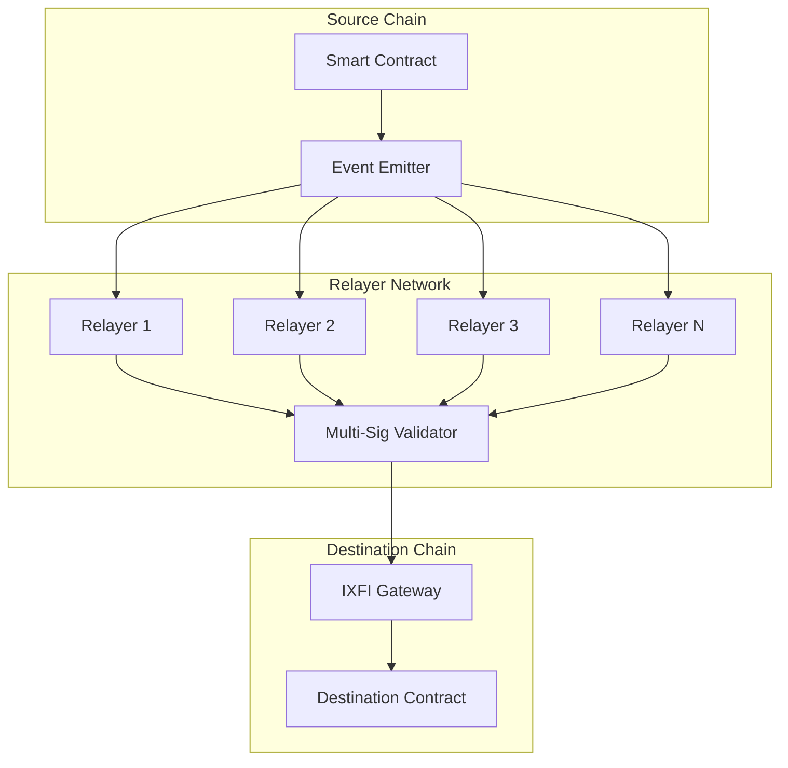

# Relayer Network

The IXFI Protocol relies on a decentralized relayer network to facilitate secure cross-chain communication and token transfers between different blockchain networks.

## Overview

The relayer network serves as the bridge infrastructure that monitors events on source chains, validates cross-chain transactions, and executes corresponding actions on destination chains. This decentralized approach ensures security, reliability, and censorship resistance.

## Architecture



## Relayer Roles

### 1. Event Monitoring

Relayers continuously monitor supported blockchains for cross-chain events:

```javascript
class EventMonitor {
    constructor(config) {
        this.provider = new ethers.JsonRpcProvider(config.rpc);
        this.gateway = new ethers.Contract(config.gatewayAddress, gatewayABI, this.provider);
        this.blockConfirmations = config.blockConfirmations;
    }

    async monitorEvents() {
        this.gateway.on("ContractCall", async (sender, destinationChain, contractAddress, payloadHash, payload, event) => {
            await this.processEvent({
                type: "CONTRACT_CALL",
                sourceChain: this.chainName,
                txHash: event.transactionHash,
                logIndex: event.logIndex,
                sender,
                destinationChain,
                contractAddress,
                payloadHash,
                payload
            });
        });

        this.gateway.on("ContractCallWithToken", async (sender, destinationChain, contractAddress, payloadHash, payload, symbol, amount, event) => {
            await this.processEvent({
                type: "CONTRACT_CALL_WITH_TOKEN",
                sourceChain: this.chainName,
                txHash: event.transactionHash,
                logIndex: event.logIndex,
                sender,
                destinationChain,
                contractAddress,
                payloadHash,
                payload,
                symbol,
                amount
            });
        });
    }
}
```

### 2. Transaction Validation

Each relayer independently validates cross-chain transactions:

```javascript
class TransactionValidator {
    async validateTransaction(event) {
        // Check block confirmations
        const currentBlock = await this.provider.getBlockNumber();
        const eventBlock = event.blockNumber;
        
        if (currentBlock - eventBlock < this.blockConfirmations) {
            return { valid: false, reason: "Insufficient confirmations" };
        }

        // Verify event authenticity
        const receipt = await this.provider.getTransactionReceipt(event.txHash);
        const eventLog = receipt.logs.find(log => 
            log.logIndex === event.logIndex && 
            log.transactionHash === event.txHash
        );

        if (!eventLog) {
            return { valid: false, reason: "Event not found" };
        }

        // Validate payload hash
        const computedHash = ethers.keccak256(event.payload);
        if (computedHash !== event.payloadHash) {
            return { valid: false, reason: "Payload hash mismatch" };
        }

        // Check for replay attacks
        const commandId = this.generateCommandId(event.txHash, event.logIndex);
        if (await this.isCommandExecuted(commandId)) {
            return { valid: false, reason: "Command already executed" };
        }

        return { valid: true };
    }
}
```

### 3. Command Signing

Valid transactions are signed by relayers using their private keys:

```javascript
class CommandSigner {
    constructor(privateKey) {
        this.wallet = new ethers.Wallet(privateKey);
    }

    async signCommand(event) {
        const commandId = this.generateCommandId(event.txHash, event.logIndex);
        
        const commandData = ethers.AbiCoder.defaultAbiCoder().encode([
            'bytes32',  // commandId
            'string',   // sourceChain
            'string',   // sourceAddress
            'bytes32',  // payloadHash
            'bytes'     // payload
        ], [
            commandId,
            event.sourceChain,
            event.sender,
            event.payloadHash,
            event.payload
        ]);

        const messageHash = ethers.keccak256(commandData);
        const signature = await this.wallet.signMessage(ethers.getBytes(messageHash));
        
        return {
            commandId,
            signature,
            signer: this.wallet.address
        };
    }
}
```

### 4. Command Execution

Once sufficient signatures are collected, commands are executed on destination chains:

```javascript
class CommandExecutor {
    async executeCommand(command, signatures) {
        // Verify minimum signature threshold
        if (signatures.length < this.minSignatures) {
            throw new Error("Insufficient signatures");
        }

        // Prepare execution data
        const executionData = ethers.AbiCoder.defaultAbiCoder().encode([
            'bytes32',     // commandId
            'string',      // sourceChain
            'string',      // sourceAddress
            'bytes',       // payload
            'bytes32[]',   // signatures
            'address[]'    // signers
        ], [
            command.commandId,
            command.sourceChain,
            command.sourceAddress,
            command.payload,
            signatures.map(s => s.signature),
            signatures.map(s => s.signer)
        ]);

        // Execute on destination chain
        const gateway = new ethers.Contract(
            this.getGatewayAddress(command.destinationChain),
            gatewayABI,
            this.getSigner(command.destinationChain)
        );

        const tx = await gateway.execute(executionData);
        const receipt = await tx.wait();

        return receipt;
    }
}
```

## Security Model

### Multi-Signature Validation

The network requires multiple relayer signatures for each cross-chain operation:

```solidity
contract RelayerManager {
    mapping(address => bool) public isRelayer;
    uint256 public minSignatures;
    uint256 public relayerCount;
    
    function validateSignatures(
        bytes32 commandId,
        bytes32[] memory signatures,
        address[] memory signers
    ) public view returns (bool) {
        require(signatures.length >= minSignatures, "Insufficient signatures");
        require(signatures.length == signers.length, "Signature count mismatch");
        
        bytes32 messageHash = keccak256(abi.encode(commandId));
        uint256 validSignatures = 0;
        
        for (uint256 i = 0; i < signatures.length; i++) {
            if (isRelayer[signers[i]] && _verifySignature(messageHash, signatures[i], signers[i])) {
                validSignatures++;
            }
        }
        
        return validSignatures >= minSignatures;
    }
}
```

### Stake-Based Security

Relayers must stake IXFI tokens to participate in the network:

```solidity
contract RelayerStaking {
    struct RelayerInfo {
        uint256 stake;
        uint256 rewards;
        uint256 penalties;
        bool isActive;
        uint256 joinedAt;
    }
    
    mapping(address => RelayerInfo) public relayers;
    uint256 public minimumStake = 10000 ether; // 10,000 IXFI
    uint256 public slashingAmount = 1000 ether; // 1,000 IXFI
    
    function stakeAsRelayer(uint256 amount) external {
        require(amount >= minimumStake, "Insufficient stake");
        
        IXFI.transferFrom(msg.sender, address(this), amount);
        
        relayers[msg.sender] = RelayerInfo({
            stake: amount,
            rewards: 0,
            penalties: 0,
            isActive: true,
            joinedAt: block.timestamp
        });
        
        emit RelayerStaked(msg.sender, amount);
    }
    
    function slashRelayer(address relayer, string memory reason) external onlyGovernance {
        require(relayers[relayer].isActive, "Relayer not active");
        
        uint256 slashAmount = min(relayers[relayer].stake, slashingAmount);
        relayers[relayer].stake -= slashAmount;
        relayers[relayer].penalties += slashAmount;
        
        if (relayers[relayer].stake < minimumStake) {
            relayers[relayer].isActive = false;
        }
        
        emit RelayerSlashed(relayer, slashAmount, reason);
    }
}
```

### Performance Monitoring

The network monitors relayer performance and availability:

```javascript
class RelayerMonitor {
    constructor() {
        this.performanceMetrics = new Map();
    }

    trackEventProcessing(relayerAddress, eventId, processingTime, success) {
        if (!this.performanceMetrics.has(relayerAddress)) {
            this.performanceMetrics.set(relayerAddress, {
                totalEvents: 0,
                successfulEvents: 0,
                averageProcessingTime: 0,
                uptime: 0
            });
        }

        const metrics = this.performanceMetrics.get(relayerAddress);
        metrics.totalEvents++;
        
        if (success) {
            metrics.successfulEvents++;
        }

        // Update average processing time
        metrics.averageProcessingTime = (
            (metrics.averageProcessingTime * (metrics.totalEvents - 1)) + processingTime
        ) / metrics.totalEvents;

        this.performanceMetrics.set(relayerAddress, metrics);
    }

    getRelayerScore(relayerAddress) {
        const metrics = this.performanceMetrics.get(relayerAddress);
        if (!metrics) return 0;

        const successRate = metrics.successfulEvents / metrics.totalEvents;
        const speedScore = Math.max(0, 1 - (metrics.averageProcessingTime / 300000)); // 5 min baseline
        
        return (successRate * 0.7) + (speedScore * 0.3);
    }
}
```

## Relayer Operations

### Running a Relayer Node

#### Hardware Requirements

| Component | Minimum | Recommended |
|-----------|---------|-------------|
| CPU | 4 cores | 8 cores |
| RAM | 8 GB | 16 GB |
| Storage | 100 GB SSD | 500 GB SSD |
| Network | 100 Mbps | 1 Gbps |
| Uptime | 95% | 99.9% |

#### Software Setup

```bash
# Clone relayer software
git clone https://github.com/DINetworks/IXFI-Relayer.git
cd IXFI-Relayer

# Install dependencies
npm install

# Configure relayer
cp config.example.json config.json
# Edit config.json with your settings

# Generate relayer keypair
npm run generate-keys

# Start relayer
npm start
```

#### Configuration Example

```json
{
  "relayer": {
    "address": "0x742d35Cc6aB8C0532FdA5c5F8E71c1e4bF7dc789",
    "privateKey": "0x...",
    "stake": "50000000000000000000000"
  },
  "chains": {
    "ethereum": {
      "rpc": "wss://mainnet.infura.io/ws/v3/YOUR_PROJECT_ID",
      "chainId": 1,
      "gatewayAddress": "0x...",
      "blockConfirmations": 12,
      "gasPrice": "20000000000"
    },
    "bsc": {
      "rpc": "wss://bsc-ws-node.nariox.org:443",
      "chainId": 56,
      "gatewayAddress": "0x...",
      "blockConfirmations": 3,
      "gasPrice": "5000000000"
    }
  },
  "monitoring": {
    "enabled": true,
    "metricsPort": 9090,
    "healthCheckPort": 8080
  }
}
```

### Economic Incentives

#### Reward Distribution

Relayers earn rewards for successful cross-chain operations:

```solidity
contract RelayerRewards {
    uint256 public constant REWARD_PER_EXECUTION = 1 ether; // 1 IXFI
    uint256 public constant BONUS_MULTIPLIER = 150; // 1.5x for fast execution
    
    function distributeRewards(
        address[] memory executingRelayers,
        uint256 executionTime,
        uint256 averageExecutionTime
    ) external {
        uint256 baseReward = REWARD_PER_EXECUTION / executingRelayers.length;
        
        for (uint256 i = 0; i < executingRelayers.length; i++) {
            uint256 reward = baseReward;
            
            // Bonus for fast execution
            if (executionTime < averageExecutionTime) {
                reward = (reward * BONUS_MULTIPLIER) / 100;
            }
            
            relayers[executingRelayers[i]].rewards += reward;
            IXFI.mint(executingRelayers[i], reward);
            
            emit RewardDistributed(executingRelayers[i], reward);
        }
    }
}
```

#### Fee Structure

| Operation Type | Base Fee | Relayer Share |
|----------------|----------|---------------|
| Token Transfer | 0.1% | 80% |
| Contract Call | 0.05% | 80% |
| Complex Execution | 0.15% | 80% |

### Governance

#### Relayer Selection

New relayers are admitted through a governance process:

```solidity
contract RelayerGovernance {
    struct RelayerProposal {
        address candidate;
        uint256 proposedStake;
        uint256 votesFor;
        uint256 votesAgainst;
        uint256 deadline;
        bool executed;
    }
    
    function proposeRelayer(address candidate, uint256 stake) external {
        require(IXFI.balanceOf(candidate) >= stake, "Insufficient balance");
        
        uint256 proposalId = nextProposalId++;
        proposals[proposalId] = RelayerProposal({
            candidate: candidate,
            proposedStake: stake,
            votesFor: 0,
            votesAgainst: 0,
            deadline: block.timestamp + 7 days,
            executed: false
        });
        
        emit RelayerProposed(proposalId, candidate, stake);
    }
    
    function voteOnProposal(uint256 proposalId, bool support) external {
        require(relayers[msg.sender].isActive, "Only active relayers can vote");
        
        RelayerProposal storage proposal = proposals[proposalId];
        require(block.timestamp <= proposal.deadline, "Voting period ended");
        
        uint256 votingPower = relayers[msg.sender].stake;
        
        if (support) {
            proposal.votesFor += votingPower;
        } else {
            proposal.votesAgainst += votingPower;
        }
        
        emit VoteCast(proposalId, msg.sender, support, votingPower);
    }
}
```

## Network Health

### Monitoring Dashboard

Real-time network health metrics:

```javascript
class NetworkHealthMonitor {
    async getNetworkHealth() {
        const metrics = {
            activeRelayers: await this.getActiveRelayerCount(),
            totalStake: await this.getTotalStakedAmount(),
            averageResponseTime: await this.getAverageResponseTime(),
            successRate: await this.getSuccessRate(),
            pendingTransactions: await this.getPendingTransactionCount()
        };

        return {
            ...metrics,
            healthScore: this.calculateHealthScore(metrics),
            status: this.getNetworkStatus(metrics)
        };
    }

    calculateHealthScore(metrics) {
        const relayerScore = Math.min(metrics.activeRelayers / 10, 1); // Target: 10+ relayers
        const stakeScore = Math.min(metrics.totalStake / 1000000, 1); // Target: 1M IXFI
        const responseScore = Math.max(0, 1 - (metrics.averageResponseTime / 300)); // Target: <5 min
        const successScore = metrics.successRate;

        return (relayerScore * 0.3) + (stakeScore * 0.2) + (responseScore * 0.3) + (successScore * 0.2);
    }
}
```

### Alert System

Automated alerts for network issues:

```javascript
class AlertSystem {
    constructor() {
        this.thresholds = {
            minActiveRelayers: 3,
            maxResponseTime: 600, // 10 minutes
            minSuccessRate: 0.95
        };
    }

    async checkAlerts() {
        const health = await this.healthMonitor.getNetworkHealth();

        if (health.activeRelayers < this.thresholds.minActiveRelayers) {
            this.sendAlert({
                level: 'CRITICAL',
                message: `Only ${health.activeRelayers} active relayers remaining`,
                action: 'RECRUIT_RELAYERS'
            });
        }

        if (health.averageResponseTime > this.thresholds.maxResponseTime) {
            this.sendAlert({
                level: 'WARNING',
                message: `Average response time: ${health.averageResponseTime}s`,
                action: 'OPTIMIZE_PERFORMANCE'
            });
        }

        if (health.successRate < this.thresholds.minSuccessRate) {
            this.sendAlert({
                level: 'CRITICAL',
                message: `Success rate dropped to ${health.successRate * 100}%`,
                action: 'INVESTIGATE_FAILURES'
            });
        }
    }
}
```

## Future Enhancements

### Planned Improvements

1. **Zero-Knowledge Proofs**: Enhanced privacy for relayer operations
2. **Optimistic Execution**: Faster finality with fraud proofs
3. **Cross-Chain Staking**: Stake tokens on one chain, operate on another
4. **Dynamic Pricing**: Adaptive fee structure based on network congestion

### Research Areas

- **Relayer Randomization**: Random selection for enhanced security
- **MEV Protection**: Preventing maximal extractable value attacks
- **Formal Verification**: Mathematical proofs of relayer network security
- **Interoperability Standards**: Adoption of cross-chain communication protocols

## Resources

- [Cross-Chain Architecture](cross-chain-architecture.md)
- [Security Model](security-model.md)
- [Relayer Setup Guide](../guides/deployment.md)
- [Network Monitoring](../resources/troubleshooting.md)
