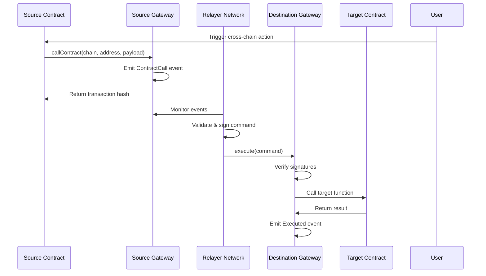

# Contract Calls

Cross-chain contract calls enable smart contracts on one blockchain to execute functions on contracts deployed on different blockchains, creating truly interoperable decentralized applications.

## Overview

Contract calls extend beyond simple token transfers by allowing arbitrary function execution across chains. This enables complex multi-chain workflows, cross-chain governance, synchronized state updates, and distributed application logic.

## Architecture



## Implementation Patterns

### 1. Simple Function Call

Execute a function on another chain without parameters:

```solidity
contract CrossChainNotifier {
    IIXFIGateway public gateway;
    
    function notifyOnChain(string memory targetChain, address targetContract) external {
        bytes memory payload = abi.encodeWithSignature("notify()");
        
        gateway.callContract(
            targetChain,
            Strings.toHexString(uint160(targetContract), 20),
            payload
        );
    }
}

contract NotificationReceiver is IXFIExecutable {
    event NotificationReceived(string sourceChain, address sourceContract);
    
    function execute(
        bytes32 commandId,
        string memory sourceChain,
        string memory sourceAddress,
        bytes memory payload
    ) external override onlyGateway {
        // Decode the function selector
        bytes4 selector = bytes4(payload);
        
        if (selector == this.notify.selector) {
            notify();
            emit NotificationReceived(sourceChain, _parseAddress(sourceAddress));
        }
    }
    
    function notify() public {
        // Notification logic here
    }
}
```

### 2. Parameterized Function Call

Execute functions with complex parameters:

```solidity
contract CrossChainDataSync {
    struct UserData {
        uint256 score;
        uint256 level;
        bool isActive;
    }
    
    function syncUserData(
        string memory targetChain,
        address targetContract,
        address user,
        UserData memory data
    ) external {
        bytes memory payload = abi.encodeWithSignature(
            "updateUserData(address,uint256,uint256,bool)",
            user,
            data.score,
            data.level,
            data.isActive
        );
        
        gateway.callContract(targetChain, targetContract, payload);
    }
}

contract DataReceiver is IXFIExecutable {
    mapping(address => UserData) public userData;
    
    function execute(
        bytes32 commandId,
        string memory sourceChain,
        string memory sourceAddress,
        bytes memory payload
    ) external override onlyGateway {
        // Execute the function call
        (bool success, bytes memory returnData) = address(this).call(payload);
        require(success, "Function execution failed");
    }
    
    function updateUserData(
        address user,
        uint256 score,
        uint256 level,
        bool isActive
    ) external {
        userData[user] = UserData(score, level, isActive);
        emit UserDataUpdated(user, score, level, isActive);
    }
}
```

### 3. Conditional Execution

Execute functions based on on-chain conditions:

```solidity
contract ConditionalExecutor is IXFIExecutable {
    mapping(bytes32 => bool) public conditions;
    
    function setCondition(bytes32 conditionId, bool value) external onlyOwner {
        conditions[conditionId] = value;
    }
    
    function execute(
        bytes32 commandId,
        string memory sourceChain,
        string memory sourceAddress,
        bytes memory payload
    ) external override onlyGateway {
        // Decode condition and actual payload
        (bytes32 conditionId, bytes memory actualPayload) = abi.decode(
            payload,
            (bytes32, bytes)
        );
        
        // Check condition
        require(conditions[conditionId], "Condition not met");
        
        // Execute conditional function
        (bool success,) = address(this).call(actualPayload);
        require(success, "Conditional execution failed");
    }
    
    function conditionalFunction(uint256 value) external {
        // Function logic here
    }
}
```

### 4. Multi-Step Workflow

Chain multiple function calls across different contracts:

```solidity
contract WorkflowOrchestrator {
    struct WorkflowStep {
        string targetChain;
        address targetContract;
        bytes payload;
        uint256 delay;
    }
    
    mapping(bytes32 => WorkflowStep[]) public workflows;
    mapping(bytes32 => uint256) public currentStep;
    
    function startWorkflow(bytes32 workflowId) external {
        require(workflows[workflowId].length > 0, "Workflow not found");
        
        WorkflowStep memory step = workflows[workflowId][0];
        currentStep[workflowId] = 0;
        
        gateway.callContract(
            step.targetChain,
            Strings.toHexString(uint160(step.targetContract), 20),
            abi.encode(workflowId, step.payload)
        );
    }
    
    function continueWorkflow(bytes32 workflowId) external {
        uint256 nextStepIndex = currentStep[workflowId] + 1;
        require(nextStepIndex < workflows[workflowId].length, "Workflow complete");
        
        WorkflowStep memory step = workflows[workflowId][nextStepIndex];
        currentStep[workflowId] = nextStepIndex;
        
        if (step.delay > 0) {
            // Schedule delayed execution
            _scheduleExecution(workflowId, step, block.timestamp + step.delay);
        } else {
            gateway.callContract(
                step.targetChain,
                Strings.toHexString(uint160(step.targetContract), 20),
                abi.encode(workflowId, step.payload)
            );
        }
    }
}
```

## Advanced Patterns

### Callback Mechanism

Implement callbacks for bidirectional communication:

```solidity
contract CallbackContract is IXFIExecutable {
    struct PendingCallback {
        string sourceChain;
        address sourceContract;
        bytes callbackData;
        uint256 timestamp;
    }
    
    mapping(bytes32 => PendingCallback) public pendingCallbacks;
    
    function callWithCallback(
        string memory targetChain,
        address targetContract,
        bytes memory payload,
        bytes memory callbackData
    ) external returns (bytes32 callbackId) {
        callbackId = keccak256(abi.encode(
            msg.sender,
            targetContract,
            payload,
            block.timestamp,
            block.number
        ));
        
        pendingCallbacks[callbackId] = PendingCallback({
            sourceChain: "current_chain",
            sourceContract: msg.sender,
            callbackData: callbackData,
            timestamp: block.timestamp
        });
        
        bytes memory wrappedPayload = abi.encode(callbackId, payload);
        
        gateway.callContract(
            targetChain,
            Strings.toHexString(uint160(targetContract), 20),
            wrappedPayload
        );
    }
    
    function executeCallback(bytes32 callbackId, bytes memory result) external {
        PendingCallback memory callback = pendingCallbacks[callbackId];
        require(callback.timestamp > 0, "Callback not found");
        
        delete pendingCallbacks[callbackId];
        
        // Execute callback on original contract
        bytes memory callbackPayload = abi.encodeWithSignature(
            "handleCallback(bytes32,bytes,bytes)",
            callbackId,
            callback.callbackData,
            result
        );
        
        gateway.callContract(
            callback.sourceChain,
            Strings.toHexString(uint160(callback.sourceContract), 20),
            callbackPayload
        );
    }
}
```

### State Synchronization

Keep state synchronized across multiple chains:

```solidity
contract MultiChainState is IXFIExecutable {
    mapping(bytes32 => uint256) public state;
    mapping(string => bool) public supportedChains;
    
    event StateUpdated(bytes32 indexed key, uint256 value, string sourceChain);
    
    function updateState(bytes32 key, uint256 value) external {
        state[key] = value;
        
        // Broadcast to all supported chains
        _broadcastStateUpdate(key, value);
        
        emit StateUpdated(key, value, "local");
    }
    
    function _broadcastStateUpdate(bytes32 key, uint256 value) internal {
        bytes memory payload = abi.encodeWithSignature(
            "syncState(bytes32,uint256)",
            key,
            value
        );
        
        // Broadcast to all supported chains
        for (uint256 i = 0; i < chainNames.length; i++) {
            if (supportedChains[chainNames[i]]) {
                gateway.callContract(
                    chainNames[i],
                    Strings.toHexString(uint160(address(this)), 20),
                    payload
                );
            }
        }
    }
    
    function execute(
        bytes32 commandId,
        string memory sourceChain,
        string memory sourceAddress,
        bytes memory payload
    ) external override onlyGateway {
        // Only accept calls from self on other chains
        require(
            _parseAddress(sourceAddress) == address(this),
            "Invalid source contract"
        );
        
        (bool success,) = address(this).call(payload);
        require(success, "State sync failed");
    }
    
    function syncState(bytes32 key, uint256 value) external {
        state[key] = value;
        emit StateUpdated(key, value, "remote");
    }
}
```

### Cross-Chain Governance

Implement governance decisions across multiple chains:

```solidity
contract CrossChainGovernance is IXFIExecutable {
    struct Proposal {
        string description;
        mapping(string => bool) chainApprovals;
        mapping(string => uint256) votes;
        uint256 requiredChains;
        uint256 approvedChains;
        bool executed;
        uint256 deadline;
    }
    
    mapping(uint256 => Proposal) public proposals;
    mapping(string => uint256) public chainWeights;
    uint256 public nextProposalId;
    
    function createProposal(
        string memory description,
        string[] memory targetChains,
        uint256 votingPeriod
    ) external returns (uint256 proposalId) {
        proposalId = nextProposalId++;
        
        Proposal storage proposal = proposals[proposalId];
        proposal.description = description;
        proposal.requiredChains = targetChains.length;
        proposal.deadline = block.timestamp + votingPeriod;
        
        // Notify all target chains about the proposal
        bytes memory payload = abi.encodeWithSignature(
            "notifyProposal(uint256,string,uint256)",
            proposalId,
            description,
            proposal.deadline
        );
        
        for (uint256 i = 0; i < targetChains.length; i++) {
            gateway.callContract(
                targetChains[i],
                Strings.toHexString(uint160(address(this)), 20),
                payload
            );
        }
    }
    
    function voteOnProposal(uint256 proposalId, bool support) external {
        // Local voting logic
        _processVote(proposalId, "local", support, msg.sender);
        
        // Broadcast vote to other chains
        bytes memory payload = abi.encodeWithSignature(
            "receiveVote(uint256,bool,address,string)",
            proposalId,
            support,
            msg.sender,
            "local"
        );
        
        // Broadcast to all chains
        _broadcastToAllChains(payload);
    }
    
    function executeProposal(uint256 proposalId) external {
        Proposal storage proposal = proposals[proposalId];
        require(!proposal.executed, "Already executed");
        require(proposal.approvedChains >= proposal.requiredChains, "Insufficient approvals");
        
        proposal.executed = true;
        
        // Execute proposal actions across chains
        _executeProposalActions(proposalId);
    }
}
```

## Error Handling

### Robust Error Recovery

```solidity
contract RobustCaller is IXFIExecutable {
    struct FailedCall {
        string targetChain;
        address targetContract;
        bytes payload;
        uint256 attempts;
        uint256 lastAttempt;
        string lastError;
    }
    
    mapping(bytes32 => FailedCall) public failedCalls;
    uint256 public constant MAX_RETRY_ATTEMPTS = 3;
    uint256 public constant RETRY_DELAY = 1 hours;
    
    function makeRobustCall(
        string memory targetChain,
        address targetContract,
        bytes memory payload
    ) external returns (bytes32 callId) {
        callId = keccak256(abi.encode(
            msg.sender,
            targetChain,
            targetContract,
            payload,
            block.timestamp
        ));
        
        try gateway.callContract(
            targetChain,
            Strings.toHexString(uint160(targetContract), 20),
            payload
        ) {
            emit CallSucceeded(callId, targetChain, targetContract);
        } catch Error(string memory reason) {
            _handleCallFailure(callId, targetChain, targetContract, payload, reason);
        } catch {
            _handleCallFailure(callId, targetChain, targetContract, payload, "Unknown error");
        }
    }
    
    function retryFailedCall(bytes32 callId) external {
        FailedCall storage failed = failedCalls[callId];
        require(failed.attempts > 0, "Call not found");
        require(failed.attempts < MAX_RETRY_ATTEMPTS, "Max attempts reached");
        require(block.timestamp >= failed.lastAttempt + RETRY_DELAY, "Too early to retry");
        
        failed.attempts++;
        failed.lastAttempt = block.timestamp;
        
        try gateway.callContract(
            failed.targetChain,
            Strings.toHexString(uint160(failed.targetContract), 20),
            failed.payload
        ) {
            delete failedCalls[callId];
            emit CallRetrySucceeded(callId);
        } catch Error(string memory reason) {
            failed.lastError = reason;
            emit CallRetryFailed(callId, reason);
        }
    }
    
    function _handleCallFailure(
        bytes32 callId,
        string memory targetChain,
        address targetContract,
        bytes memory payload,
        string memory error
    ) internal {
        failedCalls[callId] = FailedCall({
            targetChain: targetChain,
            targetContract: targetContract,
            payload: payload,
            attempts: 1,
            lastAttempt: block.timestamp,
            lastError: error
        });
        
        emit CallFailed(callId, targetChain, targetContract, error);
    }
}
```

### Circuit Breaker Pattern

```solidity
contract CircuitBreakerCaller {
    enum CircuitState { CLOSED, OPEN, HALF_OPEN }
    
    struct CircuitBreaker {
        CircuitState state;
        uint256 failureCount;
        uint256 lastFailureTime;
        uint256 nextAttemptTime;
    }
    
    mapping(string => CircuitBreaker) public circuits;
    uint256 public constant FAILURE_THRESHOLD = 5;
    uint256 public constant TIMEOUT = 5 minutes;
    uint256 public constant RETRY_TIMEOUT = 1 hours;
    
    function callWithCircuitBreaker(
        string memory targetChain,
        address targetContract,
        bytes memory payload
    ) external {
        CircuitBreaker storage circuit = circuits[targetChain];
        
        if (circuit.state == CircuitState.OPEN) {
            require(block.timestamp >= circuit.nextAttemptTime, "Circuit breaker open");
            circuit.state = CircuitState.HALF_OPEN;
        }
        
        try gateway.callContract(
            targetChain,
            Strings.toHexString(uint160(targetContract), 20),
            payload
        ) {
            _handleSuccess(targetChain);
        } catch {
            _handleFailure(targetChain);
        }
    }
    
    function _handleSuccess(string memory targetChain) internal {
        CircuitBreaker storage circuit = circuits[targetChain];
        circuit.state = CircuitState.CLOSED;
        circuit.failureCount = 0;
    }
    
    function _handleFailure(string memory targetChain) internal {
        CircuitBreaker storage circuit = circuits[targetChain];
        circuit.failureCount++;
        circuit.lastFailureTime = block.timestamp;
        
        if (circuit.failureCount >= FAILURE_THRESHOLD) {
            circuit.state = CircuitState.OPEN;
            circuit.nextAttemptTime = block.timestamp + RETRY_TIMEOUT;
        }
    }
}
```

## Security Considerations

### Input Validation

```solidity
contract SecureContractCaller {
    mapping(address => bool) public authorizedCallers;
    mapping(string => mapping(address => bool)) public trustedContracts;
    
    modifier onlyAuthorized() {
        require(authorizedCallers[msg.sender], "Unauthorized caller");
        _;
    }
    
    modifier onlyTrustedTarget(string memory chain, address target) {
        require(trustedContracts[chain][target], "Untrusted target contract");
        _;
    }
    
    function secureCall(
        string memory targetChain,
        address targetContract,
        bytes memory payload
    ) external onlyAuthorized onlyTrustedTarget(targetChain, targetContract) {
        // Validate payload
        require(payload.length > 0, "Empty payload");
        require(payload.length <= 8192, "Payload too large");
        
        // Validate function selector
        bytes4 selector = bytes4(payload);
        require(_isAllowedSelector(targetContract, selector), "Function not allowed");
        
        gateway.callContract(
            targetChain,
            Strings.toHexString(uint160(targetContract), 20),
            payload
        );
    }
    
    function _isAllowedSelector(address target, bytes4 selector) internal view returns (bool) {
        // Implement allowlist logic
        return true; // Simplified for example
    }
}
```

### Reentrancy Protection

```solidity
import "@openzeppelin/contracts/security/ReentrancyGuard.sol";

contract ReentrancyProtectedCaller is ReentrancyGuard, IXFIExecutable {
    function safeCall(
        string memory targetChain,
        address targetContract,
        bytes memory payload
    ) external nonReentrant {
        gateway.callContract(
            targetChain,
            Strings.toHexString(uint160(targetContract), 20),
            payload
        );
    }
    
    function execute(
        bytes32 commandId,
        string memory sourceChain,
        string memory sourceAddress,
        bytes memory payload
    ) external override onlyGateway nonReentrant {
        (bool success,) = address(this).call(payload);
        require(success, "Execution failed");
    }
}
```

## Gas Optimization

### Batch Contract Calls

```solidity
contract BatchCaller {
    struct Call {
        string targetChain;
        address targetContract;
        bytes payload;
    }
    
    function batchCall(Call[] memory calls) external {
        require(calls.length <= 10, "Too many calls");
        
        for (uint256 i = 0; i < calls.length; i++) {
            gateway.callContract(
                calls[i].targetChain,
                Strings.toHexString(uint160(calls[i].targetContract), 20),
                calls[i].payload
            );
        }
    }
    
    function encodedBatchCall(bytes memory encodedCalls) external {
        Call[] memory calls = abi.decode(encodedCalls, (Call[]));
        batchCall(calls);
    }
}
```

### Optimized Payload Encoding

```solidity
contract OptimizedCaller {
    function compactCall(
        string memory targetChain,
        address targetContract,
        bytes4 selector,
        bytes memory data
    ) external {
        bytes memory payload = abi.encodePacked(selector, data);
        
        gateway.callContract(
            targetChain,
            Strings.toHexString(uint160(targetContract), 20),
            payload
        );
    }
    
    function multiCall(
        string memory targetChain,
        address targetContract,
        bytes4[] memory selectors,
        bytes[] memory dataArray
    ) external {
        require(selectors.length == dataArray.length, "Array length mismatch");
        
        bytes memory payload = abi.encodeWithSignature("multiCall(bytes4[],bytes[])", selectors, dataArray);
        
        gateway.callContract(
            targetChain,
            Strings.toHexString(uint160(targetContract), 20),
            payload
        );
    }
}
```

## Testing

### Mock Contracts for Testing

```solidity
contract MockGateway is IIXFIGateway {
    event MockContractCall(string destinationChain, string contractAddress, bytes payload);
    
    function callContract(
        string memory destinationChain,
        string memory contractAddress,
        bytes memory payload
    ) external override {
        emit MockContractCall(destinationChain, contractAddress, payload);
        
        // Simulate execution on destination
        _simulateExecution(contractAddress, payload);
    }
    
    function _simulateExecution(string memory contractAddress, bytes memory payload) internal {
        // Mock execution logic for testing
        address target = _parseAddress(contractAddress);
        
        if (target != address(0)) {
            try IXFIExecutable(target).execute(
                keccak256("mock"),
                "source_chain",
                "0x1234567890123456789012345678901234567890",
                payload
            ) {
                // Success
            } catch {
                // Handle failure
            }
        }
    }
}
```

### Integration Tests

```javascript
describe("Cross-Chain Contract Calls", function() {
    let caller, receiver, gateway;
    
    beforeEach(async function() {
        // Deploy contracts
        const Gateway = await ethers.getContractFactory("MockGateway");
        gateway = await Gateway.deploy();
        
        const Caller = await ethers.getContractFactory("CrossChainCaller");
        caller = await Caller.deploy(gateway.address);
        
        const Receiver = await ethers.getContractFactory("ContractReceiver");
        receiver = await Receiver.deploy(gateway.address);
    });
    
    it("should execute cross-chain contract call", async function() {
        const payload = receiver.interface.encodeFunctionData("setValue", [42]);
        
        await expect(
            caller.callContract("ethereum", receiver.address, payload)
        ).to.emit(gateway, "MockContractCall");
        
        expect(await receiver.value()).to.equal(42);
    });
    
    it("should handle failed contract calls", async function() {
        const invalidPayload = "0x12345678"; // Invalid function selector
        
        await expect(
            caller.callContract("ethereum", receiver.address, invalidPayload)
        ).to.be.revertedWith("Function execution failed");
    });
});
```

## Best Practices

### 1. Design for Failure

Always implement proper error handling and recovery mechanisms.

### 2. Validate Inputs

Thoroughly validate all parameters before making cross-chain calls.

### 3. Use Access Control

Implement proper access control for sensitive cross-chain operations.

### 4. Optimize Gas Usage

Minimize payload size and use efficient encoding methods.

### 5. Test Thoroughly

Test all cross-chain interactions on testnets before mainnet deployment.

### 6. Monitor Operations

Implement monitoring and alerting for cross-chain contract calls.

## Resources

- [Message Passing Guide](message-passing.md)
- [Token Transfers](token-transfers.md)
- [IXFI Gateway API](../api-reference/ixfi-gateway.md)
- [Security Best Practices](../guides/security.md)
