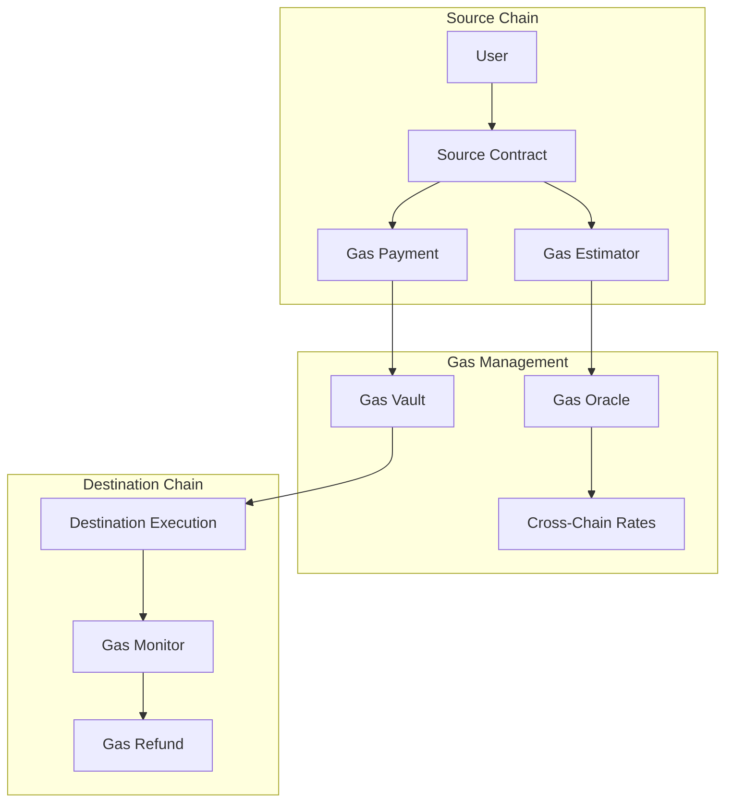

# Gas Management

Efficient gas management is crucial for cross-chain operations in the IXFI Protocol. This guide covers gas estimation, payment methods, optimization strategies, and cost management across multiple blockchains.

## Overview

Cross-chain transactions require gas on both source and destination chains. The IXFI Protocol provides several mechanisms to handle gas payments, estimate costs, and optimize gas usage for cross-chain operations.

## Gas Architecture



## Gas Payment Models

### 1. Prepaid Gas Model

Users pay gas costs upfront on the source chain:

```solidity
contract PrepaidGasManager {
    mapping(string => uint256) public gasRates; // Gas price per destination chain
    mapping(string => uint256) public gasMultipliers; // Chain-specific multipliers
    
    event GasPaid(
        address indexed user,
        string indexed destinationChain,
        uint256 gasAmount,
        uint256 nativeAmount
    );
    
    function payGasForContractCall(
        string memory destinationChain,
        uint256 gasLimit
    ) external payable returns (bytes32 gasPaymentId) {
        uint256 requiredPayment = calculateGasCost(destinationChain, gasLimit);
        require(msg.value >= requiredPayment, "Insufficient gas payment");
        
        gasPaymentId = keccak256(abi.encode(
            msg.sender,
            destinationChain,
            gasLimit,
            block.timestamp
        ));
        
        // Store gas payment for relayer reimbursement
        gasPayments[gasPaymentId] = GasPayment({
            payer: msg.sender,
            destinationChain: destinationChain,
            gasLimit: gasLimit,
            amountPaid: msg.value,
            used: false
        });
        
        emit GasPaid(msg.sender, destinationChain, gasLimit, msg.value);
        return gasPaymentId;
    }
    
    function calculateGasCost(
        string memory destinationChain,
        uint256 gasLimit
    ) public view returns (uint256) {
        uint256 baseGasPrice = gasRates[destinationChain];
        uint256 multiplier = gasMultipliers[destinationChain];
        
        // Add 20% buffer for gas price fluctuations
        return (gasLimit * baseGasPrice * multiplier * 120) / (100 * 100);
    }
}
```

### 2. Token-Based Gas Payment

Pay gas fees using IXFI or other tokens:

```solidity
contract TokenGasPayment {
    IERC20 public ixfiToken;
    mapping(string => uint256) public tokenGasRates; // IXFI per gas unit
    
    function payGasWithTokens(
        string memory destinationChain,
        uint256 gasLimit,
        uint256 tokenAmount
    ) external returns (bytes32 gasPaymentId) {
        uint256 requiredTokens = calculateTokenGasCost(destinationChain, gasLimit);
        require(tokenAmount >= requiredTokens, "Insufficient token amount");
        
        // Transfer tokens from user
        ixfiToken.transferFrom(msg.sender, address(this), tokenAmount);
        
        gasPaymentId = _createGasPayment(
            msg.sender,
            destinationChain,
            gasLimit,
            tokenAmount
        );
        
        emit TokenGasPaid(msg.sender, destinationChain, gasLimit, tokenAmount);
        return gasPaymentId;
    }
    
    function calculateTokenGasCost(
        string memory destinationChain,
        uint256 gasLimit
    ) public view returns (uint256) {
        uint256 tokenRate = tokenGasRates[destinationChain];
        uint256 baseCost = gasLimit * tokenRate;
        
        // Add buffer and convert to token units
        return (baseCost * 120) / 100;
    }
}
```

### 3. Gasless Transactions

Enable gasless transactions through meta-transactions:

```solidity
contract GaslessExecutor {
    mapping(address => uint256) public nonces;
    mapping(address => uint256) public gasCredits;
    
    struct MetaTransaction {
        address from;
        string destinationChain;
        address targetContract;
        bytes payload;
        uint256 gasLimit;
        uint256 nonce;
        bytes signature;
    }
    
    function executeGasless(MetaTransaction memory metaTx) external {
        // Verify signature
        require(_verifySignature(metaTx), "Invalid signature");
        
        // Check gas credits
        require(gasCredits[metaTx.from] >= metaTx.gasLimit, "Insufficient gas credits");
        
        // Deduct gas credits
        gasCredits[metaTx.from] -= metaTx.gasLimit;
        nonces[metaTx.from]++;
        
        // Execute cross-chain call
        gateway.callContract(
            metaTx.destinationChain,
            Strings.toHexString(uint160(metaTx.targetContract), 20),
            metaTx.payload
        );
        
        emit GaslessExecuted(metaTx.from, metaTx.destinationChain, metaTx.gasLimit);
    }
    
    function addGasCredits(address user, uint256 amount) external {
        ixfiToken.transferFrom(msg.sender, address(this), amount);
        gasCredits[user] += amount;
        
        emit GasCreditsAdded(user, amount);
    }
}
```

## Gas Estimation

### Dynamic Gas Estimation

```solidity
contract GasEstimator {
    struct ChainGasInfo {
        uint256 baseGasPrice;
        uint256 priorityFee;
        uint256 blockGasLimit;
        uint256 avgBlockTime;
        uint256 congestionMultiplier;
    }
    
    mapping(string => ChainGasInfo) public chainGasInfo;
    mapping(bytes4 => uint256) public functionGasCosts;
    
    function estimateGasForCall(
        string memory destinationChain,
        bytes memory payload
    ) external view returns (
        uint256 estimatedGas,
        uint256 estimatedCost,
        uint256 confidence
    ) {
        // Base gas for cross-chain execution
        uint256 baseGas = 50000;
        
        // Function-specific gas estimation
        bytes4 selector = bytes4(payload);
        uint256 functionGas = functionGasCosts[selector];
        
        if (functionGas == 0) {
            // Estimate based on payload size
            functionGas = _estimateGasFromPayload(payload);
        }
        
        // Chain-specific adjustments
        ChainGasInfo memory gasInfo = chainGasInfo[destinationChain];
        uint256 chainMultiplier = gasInfo.congestionMultiplier;
        
        estimatedGas = (baseGas + functionGas) * chainMultiplier / 100;
        estimatedCost = estimatedGas * (gasInfo.baseGasPrice + gasInfo.priorityFee);
        
        // Confidence based on data freshness and volatility
        confidence = _calculateConfidence(destinationChain);
        
        return (estimatedGas, estimatedCost, confidence);
    }
    
    function _estimateGasFromPayload(bytes memory payload) internal pure returns (uint256) {
        // Base gas: 21000 + 4 gas per zero byte + 16 gas per non-zero byte
        uint256 dataGas = 0;
        
        for (uint256 i = 0; i < payload.length; i++) {
            if (payload[i] == 0) {
                dataGas += 4;
            } else {
                dataGas += 16;
            }
        }
        
        return 21000 + dataGas;
    }
    
    function updateGasInfo(
        string memory chainName,
        uint256 baseGasPrice,
        uint256 priorityFee,
        uint256 congestionMultiplier
    ) external onlyOracle {
        chainGasInfo[chainName] = ChainGasInfo({
            baseGasPrice: baseGasPrice,
            priorityFee: priorityFee,
            blockGasLimit: chainGasInfo[chainName].blockGasLimit,
            avgBlockTime: chainGasInfo[chainName].avgBlockTime,
            congestionMultiplier: congestionMultiplier
        });
        
        emit GasInfoUpdated(chainName, baseGasPrice, priorityFee);
    }
}
```

### Real-Time Gas Oracle

```javascript
class GasOracle {
    constructor() {
        this.providers = new Map();
        this.gasData = new Map();
        this.updateInterval = 30000; // 30 seconds
    }

    async initializeChains(chainConfigs) {
        for (const [chainName, config] of Object.entries(chainConfigs)) {
            this.providers.set(chainName, new ethers.JsonRpcProvider(config.rpc));
            await this.updateGasData(chainName);
        }

        // Start periodic updates
        setInterval(() => this.updateAllChains(), this.updateInterval);
    }

    async updateGasData(chainName) {
        const provider = this.providers.get(chainName);
        
        try {
            const feeData = await provider.getFeeData();
            const block = await provider.getBlock('latest');
            
            const gasData = {
                gasPrice: feeData.gasPrice,
                maxFeePerGas: feeData.maxFeePerGas,
                maxPriorityFeePerGas: feeData.maxPriorityFeePerGas,
                blockGasLimit: block.gasLimit,
                blockGasUsed: block.gasUsed,
                utilization: Number(block.gasUsed * 100n / block.gasLimit),
                timestamp: Date.now()
            };

            this.gasData.set(chainName, gasData);
            
            // Update congestion multiplier based on utilization
            const congestionMultiplier = this.calculateCongestionMultiplier(gasData.utilization);
            await this.updateChainMultiplier(chainName, congestionMultiplier);

        } catch (error) {
            console.error(`Failed to update gas data for ${chainName}:`, error);
        }
    }

    calculateCongestionMultiplier(utilization) {
        if (utilization < 50) return 100; // No congestion
        if (utilization < 70) return 120; // Light congestion
        if (utilization < 85) return 150; // Moderate congestion
        if (utilization < 95) return 200; // High congestion
        return 300; // Extreme congestion
    }

    async estimateGasForOperation(chainName, operationType, payload) {
        const gasData = this.gasData.get(chainName);
        if (!gasData) throw new Error(`No gas data for chain: ${chainName}`);

        const baseGas = this.getBaseGasForOperation(operationType);
        const payloadGas = this.estimatePayloadGas(payload);
        const totalGas = baseGas + payloadGas;

        const congestionMultiplier = this.calculateCongestionMultiplier(gasData.utilization);
        const adjustedGas = Math.ceil(totalGas * congestionMultiplier / 100);

        return {
            estimatedGas: adjustedGas,
            gasPrice: gasData.gasPrice,
            maxFeePerGas: gasData.maxFeePerGas,
            estimatedCost: BigInt(adjustedGas) * gasData.gasPrice,
            confidence: this.calculateConfidence(gasData),
            congestionLevel: this.getCongestionLevel(gasData.utilization)
        };
    }

    getBaseGasForOperation(operationType) {
        const gasLimits = {
            'token_transfer': 100000,
            'contract_call': 150000,
            'contract_call_with_token': 200000,
            'complex_execution': 300000
        };

        return gasLimits[operationType] || 150000;
    }

    estimatePayloadGas(payload) {
        if (!payload) return 0;
        
        const bytes = ethers.getBytes(payload);
        let gas = 0;
        
        for (let i = 0; i < bytes.length; i++) {
            gas += bytes[i] === 0 ? 4 : 16;
        }
        
        return gas;
    }
}
```

## Gas Optimization Strategies

### 1. Payload Optimization

```solidity
contract OptimizedPayloads {
    // Instead of this (expensive)
    function expensiveCall(
        uint256 a,
        uint256 b,
        uint256 c,
        string memory text,
        address[] memory addresses
    ) external {
        // Function implementation
    }
    
    // Use this (optimized)
    function optimizedCall(bytes memory packedData) external {
        (
            uint256 a,
            uint256 b,
            uint256 c,
            string memory text,
            address[] memory addresses
        ) = abi.decode(packedData, (uint256, uint256, uint256, string, address[]));
        
        // Function implementation
    }
    
    // Even better: use packed encoding for similar types
    function superOptimizedCall(
        uint256 packedInts, // Pack multiple uint256s into one
        bytes memory packedData
    ) external {
        uint256 a = packedInts >> 128;
        uint256 b = (packedInts >> 64) & 0xFFFFFFFFFFFFFFFF;
        uint256 c = packedInts & 0xFFFFFFFFFFFFFFFF;
        
        // Decode other data as needed
    }
}
```

### 2. Batch Operations

```solidity
contract BatchGasOptimizer {
    struct BatchCall {
        address target;
        bytes data;
        uint256 gasLimit;
    }
    
    function batchExecute(
        string memory destinationChain,
        BatchCall[] memory calls
    ) external {
        require(calls.length <= 10, "Too many calls");
        
        // Encode all calls into single payload
        bytes memory batchPayload = abi.encodeWithSignature(
            "executeBatch((address,bytes,uint256)[])",
            calls
        );
        
        gateway.callContract(
            destinationChain,
            Strings.toHexString(uint160(address(this)), 20),
            batchPayload
        );
    }
    
    function executeBatch(BatchCall[] memory calls) external onlyGateway {
        for (uint256 i = 0; i < calls.length; i++) {
            (bool success,) = calls[i].target.call{gas: calls[i].gasLimit}(calls[i].data);
            if (!success) {
                emit BatchCallFailed(i, calls[i].target);
            }
        }
    }
}
```

### 3. Smart Gas Scheduling

```solidity
contract GasScheduler {
    struct ScheduledExecution {
        string destinationChain;
        address targetContract;
        bytes payload;
        uint256 executeAfter;
        uint256 maxGasPrice;
        address payer;
    }
    
    mapping(bytes32 => ScheduledExecution) public scheduledExecutions;
    
    function scheduleExecution(
        string memory destinationChain,
        address targetContract,
        bytes memory payload,
        uint256 delaySeconds,
        uint256 maxGasPrice
    ) external payable returns (bytes32 executionId) {
        executionId = keccak256(abi.encode(
            msg.sender,
            destinationChain,
            targetContract,
            payload,
            block.timestamp
        ));
        
        scheduledExecutions[executionId] = ScheduledExecution({
            destinationChain: destinationChain,
            targetContract: targetContract,
            payload: payload,
            executeAfter: block.timestamp + delaySeconds,
            maxGasPrice: maxGasPrice,
            payer: msg.sender
        });
        
        // Lock gas payment
        require(msg.value > 0, "Must pay for gas");
        
        emit ExecutionScheduled(executionId, delaySeconds, maxGasPrice);
    }
    
    function executeScheduled(bytes32 executionId) external {
        ScheduledExecution memory execution = scheduledExecutions[executionId];
        require(execution.payer != address(0), "Execution not found");
        require(block.timestamp >= execution.executeAfter, "Too early");
        
        // Check current gas price
        uint256 currentGasPrice = tx.gasprice;
        require(currentGasPrice <= execution.maxGasPrice, "Gas price too high");
        
        delete scheduledExecutions[executionId];
        
        // Execute with optimal gas conditions
        gateway.callContract(
            execution.destinationChain,
            Strings.toHexString(uint160(execution.targetContract), 20),
            execution.payload
        );
        
        emit ScheduledExecutionCompleted(executionId, currentGasPrice);
    }
}
```

## Gas Monitoring and Analytics

### Gas Usage Tracking

```solidity
contract GasMonitor {
    struct GasMetrics {
        uint256 totalGasUsed;
        uint256 totalTransactions;
        uint256 averageGasUsed;
        uint256 maxGasUsed;
        uint256 minGasUsed;
        mapping(string => uint256) chainGasUsed;
    }
    
    mapping(address => GasMetrics) public userGasMetrics;
    GasMetrics public globalGasMetrics;
    
    event GasUsageRecorded(
        address indexed user,
        string indexed chain,
        uint256 gasUsed,
        uint256 gasCost
    );
    
    function recordGasUsage(
        address user,
        string memory chain,
        uint256 gasUsed,
        uint256 gasCost
    ) external onlyGateway {
        GasMetrics storage userMetrics = userGasMetrics[user];
        
        // Update user metrics
        userMetrics.totalGasUsed += gasUsed;
        userMetrics.totalTransactions++;
        userMetrics.chainGasUsed[chain] += gasUsed;
        
        if (gasUsed > userMetrics.maxGasUsed || userMetrics.maxGasUsed == 0) {
            userMetrics.maxGasUsed = gasUsed;
        }
        
        if (gasUsed < userMetrics.minGasUsed || userMetrics.minGasUsed == 0) {
            userMetrics.minGasUsed = gasUsed;
        }
        
        userMetrics.averageGasUsed = userMetrics.totalGasUsed / userMetrics.totalTransactions;
        
        // Update global metrics
        globalGasMetrics.totalGasUsed += gasUsed;
        globalGasMetrics.totalTransactions++;
        globalGasMetrics.averageGasUsed = globalGasMetrics.totalGasUsed / globalGasMetrics.totalTransactions;
        
        emit GasUsageRecorded(user, chain, gasUsed, gasCost);
    }
    
    function getGasEfficiencyScore(address user) external view returns (uint256) {
        GasMetrics storage metrics = userGasMetrics[user];
        if (metrics.totalTransactions == 0) return 0;
        
        uint256 userAverage = metrics.averageGasUsed;
        uint256 globalAverage = globalGasMetrics.averageGasUsed;
        
        if (globalAverage == 0) return 100;
        
        // Score: 100 = average, >100 = better than average, <100 = worse
        return (globalAverage * 100) / userAverage;
    }
}
```

### Gas Alert System

```javascript
class GasAlertSystem {
    constructor(gasOracle) {
        this.gasOracle = gasOracle;
        this.alerts = new Map();
        this.thresholds = {
            highGasPrice: ethers.parseUnits('50', 'gwei'),
            veryHighGasPrice: ethers.parseUnits('100', 'gwei'),
            extremeGasPrice: ethers.parseUnits('200', 'gwei')
        };
    }

    async checkGasAlerts() {
        for (const [chainName, gasData] of this.gasOracle.gasData) {
            const currentPrice = gasData.gasPrice;
            
            if (currentPrice >= this.thresholds.extremeGasPrice) {
                this.sendAlert({
                    level: 'CRITICAL',
                    chain: chainName,
                    message: `Extreme gas prices: ${ethers.formatUnits(currentPrice, 'gwei')} gwei`,
                    recommendation: 'Consider delaying non-urgent transactions'
                });
            } else if (currentPrice >= this.thresholds.veryHighGasPrice) {
                this.sendAlert({
                    level: 'WARNING',
                    chain: chainName,
                    message: `Very high gas prices: ${ethers.formatUnits(currentPrice, 'gwei')} gwei`,
                    recommendation: 'Use gas scheduling for optimal costs'
                });
            } else if (currentPrice >= this.thresholds.highGasPrice) {
                this.sendAlert({
                    level: 'INFO',
                    chain: chainName,
                    message: `High gas prices: ${ethers.formatUnits(currentPrice, 'gwei')} gwei`,
                    recommendation: 'Consider gas optimization strategies'
                });
            }
        }
    }

    async suggestOptimalTiming(chainName, targetGasPrice) {
        const gasData = this.gasOracle.gasData.get(chainName);
        if (!gasData) return null;

        const currentPrice = gasData.gasPrice;
        
        if (currentPrice <= targetGasPrice) {
            return {
                execute: 'now',
                reason: 'Current gas price is acceptable'
            };
        }

        // Analyze historical patterns to suggest optimal timing
        const historicalData = await this.getHistoricalGasData(chainName, 24); // 24 hours
        const optimalHours = this.analyzeOptimalHours(historicalData);

        return {
            execute: 'later',
            suggestedHours: optimalHours,
            currentPrice: ethers.formatUnits(currentPrice, 'gwei'),
            targetPrice: ethers.formatUnits(targetGasPrice, 'gwei'),
            potentialSavings: this.calculateSavings(currentPrice, targetGasPrice)
        };
    }
}
```

## Gas Refund Mechanisms

### Automatic Gas Refunds

```solidity
contract GasRefundManager {
    mapping(bytes32 => uint256) public gasRefunds;
    mapping(address => uint256) public userRefundBalance;
    
    event GasRefundIssued(bytes32 indexed commandId, address user, uint256 amount);
    event GasRefundClaimed(address indexed user, uint256 amount);
    
    function processGasRefund(
        bytes32 commandId,
        address user,
        uint256 gasUsed,
        uint256 gasPrice,
        uint256 paidAmount
    ) external onlyRelayer {
        uint256 actualCost = gasUsed * gasPrice;
        
        if (paidAmount > actualCost) {
            uint256 refundAmount = paidAmount - actualCost;
            userRefundBalance[user] += refundAmount;
            gasRefunds[commandId] = refundAmount;
            
            emit GasRefundIssued(commandId, user, refundAmount);
        }
    }
    
    function claimRefund() external {
        uint256 refundAmount = userRefundBalance[msg.sender];
        require(refundAmount > 0, "No refund available");
        
        userRefundBalance[msg.sender] = 0;
        
        (bool success,) = msg.sender.call{value: refundAmount}("");
        require(success, "Refund transfer failed");
        
        emit GasRefundClaimed(msg.sender, refundAmount);
    }
    
    function claimRefundInTokens(address token) external {
        uint256 refundAmount = userRefundBalance[msg.sender];
        require(refundAmount > 0, "No refund available");
        
        userRefundBalance[msg.sender] = 0;
        
        // Convert to token amount based on current rates
        uint256 tokenAmount = _convertToTokens(token, refundAmount);
        IERC20(token).transfer(msg.sender, tokenAmount);
        
        emit GasRefundClaimed(msg.sender, refundAmount);
    }
}
```

## Best Practices

### 1. Gas Estimation

- Always add a buffer (10-20%) to gas estimates
- Monitor gas price trends before execution
- Use dynamic gas pricing for better efficiency

### 2. Payment Strategy

- Choose payment method based on cost efficiency
- Consider token-based payments during high ETH gas prices
- Implement gas scheduling for non-urgent transactions

### 3. Optimization Techniques

- Batch multiple operations when possible
- Optimize payload encoding
- Use compression for large data

### 4. Monitoring

- Track gas usage patterns
- Set up alerts for high gas prices
- Analyze efficiency metrics regularly

### 5. User Experience

- Provide clear gas cost estimates
- Offer multiple payment options
- Implement gasless options for small transactions

## Resources

- [Cross-Chain Architecture](../core-concepts/cross-chain-architecture.md)
- [Token Transfers](token-transfers.md)
- [Meta Transactions](meta-transactions.md)
- [API Reference](../api-reference/ixfi-gateway.md)
