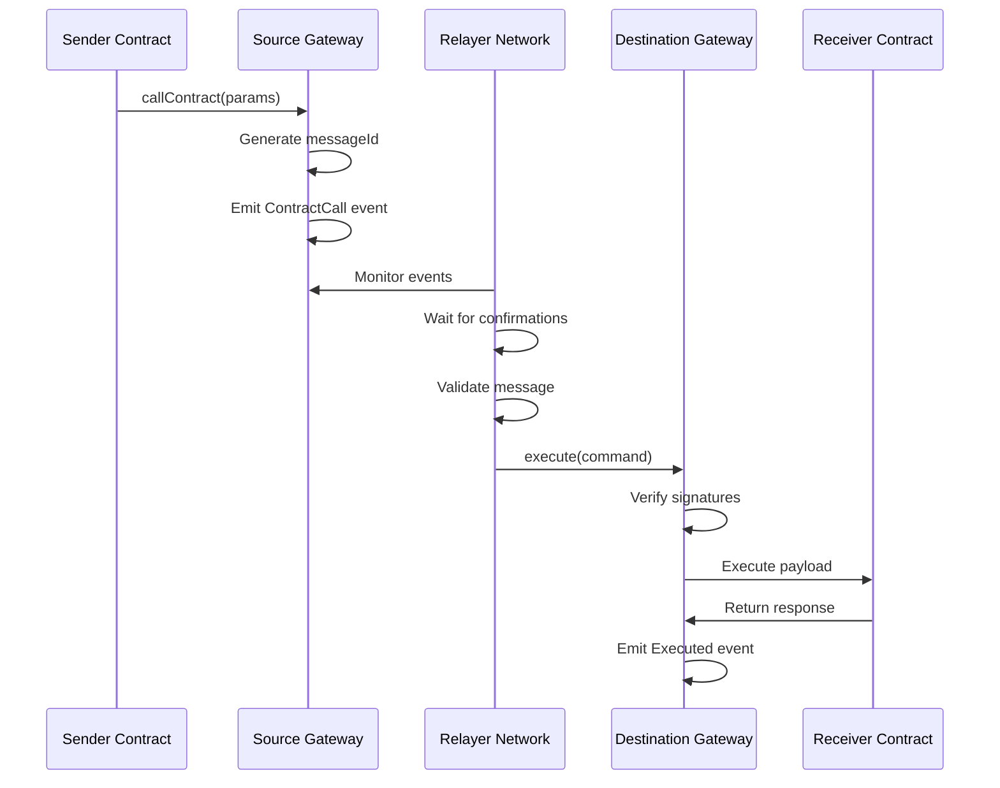

# Message Passing

IXFI Protocol implements a sophisticated message passing system that enables secure and reliable communication between smart contracts across different blockchain networks.

## Overview

The message passing system allows smart contracts on one blockchain to call functions on smart contracts deployed on different blockchains, enabling true cross-chain smart contract interaction.

## Message Structure

### Basic Message Format

```solidity
struct CrossChainMessage {
    bytes32 messageId;           // Unique message identifier
    string sourceChain;          // Source blockchain name
    string destinationChain;     // Target blockchain name
    address sourceAddress;       // Sender contract address
    string destinationAddress;   // Target contract address
    bytes payload;              // Function call data
    uint256 gasLimit;           // Gas limit for execution
    uint256 timestamp;          // Message creation time
    bytes32 payloadHash;        // Hash of the payload
}
```

### Message Types

The protocol supports different types of cross-chain messages:

```solidity
enum MessageType {
    CONTRACT_CALL,              // Simple contract call
    CONTRACT_CALL_WITH_TOKEN,   // Contract call with token transfer
    TOKEN_TRANSFER,             // Pure token transfer
    GOVERNANCE_ACTION           // Protocol governance actions
}
```

## Message Lifecycle



## Implementation

### Sending Messages

To send a cross-chain message, contracts call the IXFI Gateway:

```solidity
interface IIXFIGateway {
    function callContract(
        string memory destinationChain,
        string memory contractAddress,
        bytes memory payload
    ) external;
    
    function callContractWithToken(
        string memory destinationChain,
        string memory contractAddress,
        bytes memory payload,
        string memory symbol,
        uint256 amount
    ) external;
}
```

### Example Usage

```solidity
contract CrossChainVoting {
    IIXFIGateway public gateway;
    
    function castVoteOnChain(
        string memory targetChain,
        string memory votingContract,
        uint256 proposalId,
        bool support
    ) external {
        bytes memory payload = abi.encodeWithSignature(
            "receiveVote(uint256,bool,address)",
            proposalId,
            support,
            msg.sender
        );
        
        gateway.callContract(
            targetChain,
            votingContract,
            payload
        );
    }
}
```

### Receiving Messages

Contracts receiving cross-chain messages must implement the `IXFIExecutable` interface:

```solidity
interface IXFIExecutable {
    function execute(
        bytes32 commandId,
        string memory sourceChain,
        string memory sourceAddress,
        bytes memory payload
    ) external;
    
    function executeWithToken(
        bytes32 commandId,
        string memory sourceChain,
        string memory sourceAddress,
        bytes memory payload,
        string memory tokenSymbol,
        uint256 amount
    ) external;
}
```

### Example Implementation

```solidity
contract CrossChainReceiver is IXFIExecutable {
    IIXFIGateway public gateway;
    
    modifier onlyGateway() {
        require(msg.sender == address(gateway), "Only gateway");
        _;
    }
    
    function execute(
        bytes32 commandId,
        string memory sourceChain,
        string memory sourceAddress,
        bytes memory payload
    ) external override onlyGateway {
        // Decode and execute the payload
        (string memory action, bytes memory data) = abi.decode(
            payload, 
            (string, bytes)
        );
        
        if (keccak256(bytes(action)) == keccak256("updateState")) {
            _updateState(data);
        } else if (keccak256(bytes(action)) == keccak256("transferOwnership")) {
            _transferOwnership(data);
        }
    }
    
    function executeWithToken(
        bytes32 commandId,
        string memory sourceChain,
        string memory sourceAddress,
        bytes memory payload,
        string memory tokenSymbol,
        uint256 amount
    ) external override onlyGateway {
        // Handle token transfer and execute logic
        _processTokenTransfer(tokenSymbol, amount);
        execute(commandId, sourceChain, sourceAddress, payload);
    }
}
```

## Security Considerations

### Message Validation

All cross-chain messages undergo rigorous validation:

1. **Signature Verification**: Multi-signature validation from relayer network
2. **Replay Protection**: Command IDs prevent duplicate execution
3. **Source Verification**: Validates the actual source contract
4. **Payload Integrity**: Hash verification ensures payload integrity

### Access Control

```solidity
contract SecureReceiver is IXFIExecutable {
    mapping(string => mapping(string => bool)) public trustedSources;
    
    modifier onlyTrustedSource(string memory sourceChain, string memory sourceAddress) {
        require(
            trustedSources[sourceChain][sourceAddress],
            "Untrusted source"
        );
        _;
    }
    
    function execute(
        bytes32 commandId,
        string memory sourceChain,
        string memory sourceAddress,
        bytes memory payload
    ) external override onlyGateway onlyTrustedSource(sourceChain, sourceAddress) {
        // Secure execution logic
    }
}
```

### Anti-Replay Mechanisms

```solidity
mapping(bytes32 => bool) public processedCommands;

function execute(bytes32 commandId, ...) external {
    require(!processedCommands[commandId], "Already processed");
    processedCommands[commandId] = true;
    
    // Execute logic
}
```

## Gas Management

### Gas Estimation

The protocol provides gas estimation for cross-chain calls:

```solidity
function estimateGas(
    string memory destinationChain,
    string memory contractAddress,
    bytes memory payload
) external view returns (uint256) {
    // Calculate estimated gas for execution
    return _estimateExecutionGas(destinationChain, payload);
}
```

### Gas Payment Models

#### 1. Prepaid Gas

```solidity
function callContractWithGas(
    string memory destinationChain,
    string memory contractAddress,
    bytes memory payload,
    uint256 gasLimit
) external payable {
    require(msg.value >= _calculateGasCost(destinationChain, gasLimit));
    // Process call with prepaid gas
}
```

#### 2. Token-Based Gas Payment

```solidity
function callContractWithTokenGas(
    string memory destinationChain,
    string memory contractAddress,
    bytes memory payload,
    uint256 gasLimit,
    address gasToken,
    uint256 gasAmount
) external {
    IERC20(gasToken).transferFrom(msg.sender, address(this), gasAmount);
    // Process call with token-based gas payment
}
```

## Error Handling

### Execution Failures

```solidity
event ExecutionFailed(
    bytes32 indexed commandId,
    string reason,
    bytes lowLevelData
);

function execute(bytes32 commandId, ...) external {
    try this._execute(commandId, ...) {
        emit ExecutionSucceeded(commandId);
    } catch Error(string memory reason) {
        emit ExecutionFailed(commandId, reason, "");
    } catch (bytes memory lowLevelData) {
        emit ExecutionFailed(commandId, "Low level error", lowLevelData);
    }
}
```

### Retry Mechanisms

```solidity
mapping(bytes32 => uint256) public retryCount;
uint256 public constant MAX_RETRIES = 3;

function retryExecution(bytes32 commandId) external onlyOwner {
    require(retryCount[commandId] < MAX_RETRIES, "Max retries exceeded");
    retryCount[commandId]++;
    
    // Retry execution logic
}
```

## Advanced Features

### Conditional Execution

```solidity
function callContractConditional(
    string memory destinationChain,
    string memory contractAddress,
    bytes memory payload,
    bytes memory condition
) external {
    bytes32 messageId = _generateMessageId();
    
    // Store condition for validation on destination
    conditionalMessages[messageId] = condition;
    
    gateway.callContract(destinationChain, contractAddress, payload);
}
```

### Batch Message Processing

```solidity
struct BatchMessage {
    string destinationChain;
    string contractAddress;
    bytes payload;
}

function callContractBatch(BatchMessage[] memory messages) external {
    for (uint256 i = 0; i < messages.length; i++) {
        gateway.callContract(
            messages[i].destinationChain,
            messages[i].contractAddress,
            messages[i].payload
        );
    }
}
```

### Message Scheduling

```solidity
function scheduleCall(
    string memory destinationChain,
    string memory contractAddress,
    bytes memory payload,
    uint256 executeAfter
) external {
    bytes32 messageId = _generateMessageId();
    
    scheduledMessages[messageId] = ScheduledMessage({
        destinationChain: destinationChain,
        contractAddress: contractAddress,
        payload: payload,
        executeAfter: executeAfter,
        executed: false
    });
    
    emit MessageScheduled(messageId, executeAfter);
}
```

## Best Practices

### For Senders

1. **Validate Destinations**: Ensure target contracts exist and are correct
2. **Optimize Payload**: Minimize payload size to reduce gas costs
3. **Handle Failures**: Implement proper error handling for failed calls
4. **Gas Management**: Provide adequate gas for execution

### For Receivers

1. **Implement Security**: Always verify message sources
2. **Idempotent Operations**: Design functions to handle potential replays
3. **Gas Efficiency**: Optimize execution to minimize gas usage
4. **State Management**: Properly manage state changes from cross-chain calls

### General Guidelines

1. **Testing**: Thoroughly test cross-chain interactions on testnets
2. **Monitoring**: Implement monitoring for cross-chain message status
3. **Documentation**: Document cross-chain integration clearly
4. **Upgradability**: Consider upgrade paths for cross-chain contracts

## Integration Examples

### Simple Cross-Chain Counter

```solidity
contract CrossChainCounter is IXFIExecutable {
    uint256 public count;
    mapping(string => uint256) public chainCounts;
    
    function incrementOnChain(string memory targetChain) external {
        bytes memory payload = abi.encodeWithSignature("increment()");
        gateway.callContract(targetChain, address(this).toString(), payload);
    }
    
    function execute(
        bytes32,
        string memory sourceChain,
        string memory,
        bytes memory payload
    ) external override onlyGateway {
        (bool success,) = address(this).call(payload);
        require(success, "Execution failed");
        
        chainCounts[sourceChain]++;
    }
    
    function increment() external {
        count++;
    }
}
```

### Cross-Chain Token Vault

```solidity
contract CrossChainVault is IXFIExecutable {
    mapping(address => uint256) public balances;
    
    function depositToChain(
        string memory targetChain,
        uint256 amount
    ) external {
        require(balances[msg.sender] >= amount, "Insufficient balance");
        
        bytes memory payload = abi.encodeWithSignature(
            "creditUser(address,uint256)",
            msg.sender,
            amount
        );
        
        gateway.callContractWithToken(
            targetChain,
            address(this).toString(),
            payload,
            "IXFI",
            amount
        );
        
        balances[msg.sender] -= amount;
    }
    
    function executeWithToken(
        bytes32,
        string memory,
        string memory,
        bytes memory payload,
        string memory,
        uint256 amount
    ) external override onlyGateway {
        (address user, uint256 creditAmount) = abi.decode(
            payload,
            (address, uint256)
        );
        
        require(amount == creditAmount, "Amount mismatch");
        balances[user] += amount;
    }
}
```

## Resources

- [Cross-Chain Architecture](cross-chain-architecture.md)
- [Token Transfer Guide](../cross-chain/token-transfers.md)
- [Contract Call Examples](../examples/cross-chain-swap.md)
- [Security Best Practices](../guides/security.md)
