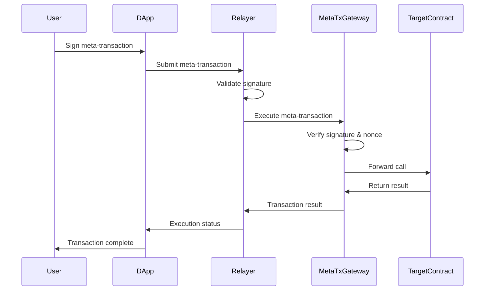

# Meta Transactions

Meta transactions enable gasless user experiences by allowing relayers to pay transaction fees on behalf of users. This guide covers the IXFI Protocol's meta-transaction implementation, use cases, and integration patterns.

## Overview

Meta transactions separate transaction execution from gas payment, allowing users to interact with smart contracts without holding native tokens for gas fees. This dramatically improves user experience, especially for new users and cross-chain operations.

## Architecture



## Core Components

### Meta Transaction Structure

```solidity
struct MetaTransaction {
    address from;           // User's address
    address to;             // Target contract address
    uint256 value;          // ETH value to send
    bytes data;             // Function call data
    uint256 nonce;          // User's nonce
    uint256 gasLimit;       // Gas limit for execution
    uint256 gasPrice;       // Gas price (can be 0 for gasless)
    address gasToken;       // Token to pay gas fees (address(0) for ETH)
    uint256 gasTokenAmount; // Amount of gas tokens
    uint256 deadline;       // Expiration timestamp
    bytes signature;        // User's signature
}
```

### Meta Transaction Gateway

```solidity
contract MetaTxGateway is EIP712 {
    using ECDSA for bytes32;
    
    mapping(address => uint256) public nonces;
    mapping(address => bool) public trustedRelayers;
    mapping(address => uint256) public gasCredits;
    
    bytes32 private constant META_TRANSACTION_TYPEHASH = keccak256(
        "MetaTransaction(address from,address to,uint256 value,bytes data,uint256 nonce,uint256 gasLimit,uint256 gasPrice,address gasToken,uint256 gasTokenAmount,uint256 deadline)"
    );
    
    event MetaTransactionExecuted(
        address indexed user,
        address indexed relayer,
        address indexed target,
        bool success,
        bytes returnData
    );
    
    constructor() EIP712("IXFI Meta Transaction", "1") {}
    
    function executeMetaTransaction(
        MetaTransaction memory metaTx
    ) external returns (bool success, bytes memory returnData) {
        // Verify relayer authorization
        require(trustedRelayers[msg.sender], "Unauthorized relayer");
        
        // Verify signature and nonce
        require(_verifyMetaTransaction(metaTx), "Invalid meta transaction");
        
        // Check deadline
        require(block.timestamp <= metaTx.deadline, "Transaction expired");
        
        // Increment nonce
        nonces[metaTx.from]++;
        
        // Handle gas payment
        _handleGasPayment(metaTx);
        
        // Execute the transaction
        (success, returnData) = _executeTransaction(metaTx);
        
        emit MetaTransactionExecuted(
            metaTx.from,
            msg.sender,
            metaTx.to,
            success,
            returnData
        );
        
        return (success, returnData);
    }
    
    function _verifyMetaTransaction(
        MetaTransaction memory metaTx
    ) internal view returns (bool) {
        bytes32 structHash = keccak256(abi.encode(
            META_TRANSACTION_TYPEHASH,
            metaTx.from,
            metaTx.to,
            metaTx.value,
            keccak256(metaTx.data),
            metaTx.nonce,
            metaTx.gasLimit,
            metaTx.gasPrice,
            metaTx.gasToken,
            metaTx.gasTokenAmount,
            metaTx.deadline
        ));
        
        bytes32 hash = _hashTypedDataV4(structHash);
        address signer = hash.recover(metaTx.signature);
        
        return signer == metaTx.from && metaTx.nonce == nonces[metaTx.from];
    }
    
    function _executeTransaction(
        MetaTransaction memory metaTx
    ) internal returns (bool success, bytes memory returnData) {
        // Set the meta-transaction context
        _setMsgSender(metaTx.from);
        
        try this.forwardCall{gas: metaTx.gasLimit}(
            metaTx.to,
            metaTx.value,
            metaTx.data
        ) returns (bytes memory result) {
            success = true;
            returnData = result;
        } catch Error(string memory reason) {
            success = false;
            returnData = bytes(reason);
        } catch (bytes memory lowLevelData) {
            success = false;
            returnData = lowLevelData;
        }
        
        _clearMsgSender();
        return (success, returnData);
    }
}
```

### Context Manager

```solidity
contract MetaTxContext {
    address private _msgSender;
    bool private _msgSenderSet;
    
    modifier onlyMetaTxGateway() {
        require(msg.sender == metaTxGateway, "Only meta-tx gateway");
        _;
    }
    
    function _setMsgSender(address sender) internal onlyMetaTxGateway {
        _msgSender = sender;
        _msgSenderSet = true;
    }
    
    function _clearMsgSender() internal onlyMetaTxGateway {
        _msgSender = address(0);
        _msgSenderSet = false;
    }
    
    function _msgSender() internal view returns (address) {
        if (_msgSenderSet) {
            return _msgSender;
        }
        return msg.sender;
    }
    
    function _msgData() internal view returns (bytes calldata) {
        return msg.data;
    }
}
```

## Implementation Patterns

### 1. Gasless Token Transfers

```solidity
contract GaslessToken is ERC20, MetaTxContext {
    constructor() ERC20("Gasless Token", "GLT") {}
    
    function transfer(address to, uint256 amount) public override returns (bool) {
        address owner = _msgSender(); // Use meta-tx context
        _transfer(owner, to, amount);
        return true;
    }
    
    function transferFrom(address from, address to, uint256 amount) public override returns (bool) {
        address spender = _msgSender(); // Use meta-tx context
        _spendAllowance(from, spender, amount);
        _transfer(from, to, amount);
        return true;
    }
    
    function approve(address spender, uint256 amount) public override returns (bool) {
        address owner = _msgSender(); // Use meta-tx context
        _approve(owner, spender, amount);
        return true;
    }
}
```

### 2. Gasless NFT Minting

```solidity
contract GaslessNFT is ERC721, MetaTxContext {
    uint256 private _tokenIdCounter;
    mapping(address => bool) public hasMinted;
    
    constructor() ERC721("Gasless NFT", "GNFT") {}
    
    function mint() external {
        address user = _msgSender();
        require(!hasMinted[user], "Already minted");
        
        uint256 tokenId = _tokenIdCounter++;
        _safeMint(user, tokenId);
        hasMinted[user] = true;
    }
    
    function transfer(address to, uint256 tokenId) external {
        address owner = _msgSender();
        require(ownerOf(tokenId) == owner, "Not token owner");
        _transfer(owner, to, tokenId);
    }
}
```

### 3. Gasless Governance Voting

```solidity
contract GaslessGovernance is MetaTxContext {
    struct Proposal {
        string description;
        uint256 votesFor;
        uint256 votesAgainst;
        uint256 deadline;
        bool executed;
        mapping(address => bool) hasVoted;
    }
    
    mapping(uint256 => Proposal) public proposals;
    uint256 public proposalCount;
    
    IERC20 public votingToken;
    
    function vote(uint256 proposalId, bool support) external {
        address voter = _msgSender();
        Proposal storage proposal = proposals[proposalId];
        
        require(block.timestamp <= proposal.deadline, "Voting ended");
        require(!proposal.hasVoted[voter], "Already voted");
        require(votingToken.balanceOf(voter) > 0, "No voting power");
        
        uint256 votingPower = votingToken.balanceOf(voter);
        
        if (support) {
            proposal.votesFor += votingPower;
        } else {
            proposal.votesAgainst += votingPower;
        }
        
        proposal.hasVoted[voter] = true;
        
        emit VoteCast(proposalId, voter, support, votingPower);
    }
}
```

### 4. Cross-Chain Gasless Operations

```solidity
contract CrossChainGasless is MetaTxContext {
    IIXFIGateway public gateway;
    mapping(address => uint256) public gaslessCredits;
    
    function crossChainCallGasless(
        string memory destinationChain,
        address targetContract,
        bytes memory payload,
        uint256 gasLimit
    ) external {
        address user = _msgSender();
        
        // Check gasless credits
        require(gaslessCredits[user] >= gasLimit, "Insufficient gasless credits");
        gaslessCredits[user] -= gasLimit;
        
        // Prepare meta-transaction for destination chain
        bytes memory metaTxPayload = abi.encode(
            user,
            targetContract,
            payload,
            gasLimit
        );
        
        gateway.callContract(
            destinationChain,
            address(this), // This contract on destination chain
            metaTxPayload
        );
        
        emit CrossChainGaslessCall(user, destinationChain, targetContract);
    }
    
    function addGaslessCredits(address user, uint256 amount) external {
        // Allow sponsors to add credits for users
        IERC20(gasToken).transferFrom(msg.sender, address(this), amount);
        gaslessCredits[user] += amount;
        
        emit GaslessCreditsAdded(user, amount, msg.sender);
    }
}
```

## Client-Side Implementation

### JavaScript SDK

```javascript
class MetaTransactionManager {
    constructor(provider, gatewayAddress, chainId) {
        this.provider = provider;
        this.gateway = new ethers.Contract(gatewayAddress, gatewayABI, provider);
        this.chainId = chainId;
        this.domain = {
            name: "IXFI Meta Transaction",
            version: "1",
            chainId: chainId,
            verifyingContract: gatewayAddress
        };
    }

    async createMetaTransaction(userAddress, targetAddress, data, options = {}) {
        const nonce = await this.gateway.nonces(userAddress);
        
        const metaTx = {
            from: userAddress,
            to: targetAddress,
            value: options.value || 0,
            data: data,
            nonce: nonce,
            gasLimit: options.gasLimit || 250000,
            gasPrice: options.gasPrice || 0,
            gasToken: options.gasToken || ethers.ZeroAddress,
            gasTokenAmount: options.gasTokenAmount || 0,
            deadline: options.deadline || Math.floor(Date.now() / 1000) + 3600 // 1 hour
        };

        return metaTx;
    }

    async signMetaTransaction(signer, metaTx) {
        const types = {
            MetaTransaction: [
                { name: "from", type: "address" },
                { name: "to", type: "address" },
                { name: "value", type: "uint256" },
                { name: "data", type: "bytes" },
                { name: "nonce", type: "uint256" },
                { name: "gasLimit", type: "uint256" },
                { name: "gasPrice", type: "uint256" },
                { name: "gasToken", type: "address" },
                { name: "gasTokenAmount", type: "uint256" },
                { name: "deadline", type: "uint256" }
            ]
        };

        const signature = await signer.signTypedData(this.domain, types, metaTx);
        
        return {
            ...metaTx,
            signature: signature
        };
    }

    async executeMetaTransaction(signedMetaTx, relayerSigner) {
        const tx = await this.gateway.connect(relayerSigner).executeMetaTransaction(signedMetaTx);
        return await tx.wait();
    }

    async estimateGas(metaTx) {
        try {
            const gasEstimate = await this.gateway.estimateGas.executeMetaTransaction(metaTx);
            return gasEstimate;
        } catch (error) {
            console.error("Gas estimation failed:", error);
            return BigInt(500000); // Fallback
        }
    }
}
```

### React Hook

```jsx
import { useState, useCallback } from 'react';
import { useWallet } from './useWallet';

export function useMetaTransactions(gatewayAddress, chainId) {
    const { signer, address } = useWallet();
    const [isLoading, setIsLoading] = useState(false);
    const [error, setError] = useState(null);

    const metaTxManager = useMemo(() => {
        if (!signer) return null;
        return new MetaTransactionManager(signer.provider, gatewayAddress, chainId);
    }, [signer, gatewayAddress, chainId]);

    const executeGasless = useCallback(async (
        targetContract,
        functionName,
        args = [],
        options = {}
    ) => {
        if (!metaTxManager || !signer || !address) {
            throw new Error('Wallet not connected');
        }

        setIsLoading(true);
        setError(null);

        try {
            // Encode function call
            const iface = new ethers.Interface([`function ${functionName}`]);
            const data = iface.encodeFunctionData(functionName, args);

            // Create meta-transaction
            const metaTx = await metaTxManager.createMetaTransaction(
                address,
                targetContract,
                data,
                options
            );

            // Sign meta-transaction
            const signedMetaTx = await metaTxManager.signMetaTransaction(signer, metaTx);

            // Submit to relayer service
            const result = await submitToRelayer(signedMetaTx);

            return result;
        } catch (err) {
            setError(err.message);
            throw err;
        } finally {
            setIsLoading(false);
        }
    }, [metaTxManager, signer, address]);

    return {
        executeGasless,
        isLoading,
        error
    };
}

async function submitToRelayer(signedMetaTx) {
    const response = await fetch('/api/meta-transactions', {
        method: 'POST',
        headers: {
            'Content-Type': 'application/json'
        },
        body: JSON.stringify(signedMetaTx)
    });

    if (!response.ok) {
        throw new Error('Failed to submit meta-transaction');
    }

    return await response.json();
}
```

## Relayer Service

### Node.js Relayer

```javascript
class MetaTransactionRelayer {
    constructor(config) {
        this.provider = new ethers.JsonRpcProvider(config.rpc);
        this.wallet = new ethers.Wallet(config.privateKey, this.provider);
        this.gateway = new ethers.Contract(
            config.gatewayAddress,
            gatewayABI,
            this.wallet
        );
        this.gasPrice = config.gasPrice || ethers.parseUnits('20', 'gwei');
        this.maxGasLimit = config.maxGasLimit || 1000000;
    }

    async processMetaTransaction(signedMetaTx) {
        try {
            // Validate meta-transaction
            const isValid = await this.validateMetaTransaction(signedMetaTx);
            if (!isValid) {
                throw new Error('Invalid meta-transaction');
            }

            // Check gas limits
            if (signedMetaTx.gasLimit > this.maxGasLimit) {
                throw new Error('Gas limit too high');
            }

            // Execute meta-transaction
            const tx = await this.gateway.executeMetaTransaction(signedMetaTx, {
                gasLimit: signedMetaTx.gasLimit + 50000, // Add buffer for gateway overhead
                gasPrice: this.gasPrice
            });

            const receipt = await tx.wait();

            return {
                success: true,
                txHash: receipt.hash,
                gasUsed: receipt.gasUsed.toString(),
                blockNumber: receipt.blockNumber
            };

        } catch (error) {
            console.error('Meta-transaction execution failed:', error);
            return {
                success: false,
                error: error.message
            };
        }
    }

    async validateMetaTransaction(metaTx) {
        // Check signature
        const domain = {
            name: "IXFI Meta Transaction",
            version: "1",
            chainId: await this.provider.getNetwork().then(n => n.chainId),
            verifyingContract: await this.gateway.getAddress()
        };

        const types = {
            MetaTransaction: [
                { name: "from", type: "address" },
                { name: "to", type: "address" },
                { name: "value", type: "uint256" },
                { name: "data", type: "bytes" },
                { name: "nonce", type: "uint256" },
                { name: "gasLimit", type: "uint256" },
                { name: "gasPrice", type: "uint256" },
                { name: "gasToken", type: "address" },
                { name: "gasTokenAmount", type: "uint256" },
                { name: "deadline", type: "uint256" }
            ]
        };

        try {
            const recoveredAddress = ethers.verifyTypedData(
                domain,
                types,
                metaTx,
                metaTx.signature
            );

            if (recoveredAddress.toLowerCase() !== metaTx.from.toLowerCase()) {
                return false;
            }

            // Check nonce
            const currentNonce = await this.gateway.nonces(metaTx.from);
            if (metaTx.nonce !== currentNonce) {
                return false;
            }

            // Check deadline
            if (metaTx.deadline < Math.floor(Date.now() / 1000)) {
                return false;
            }

            return true;
        } catch (error) {
            console.error('Signature validation failed:', error);
            return false;
        }
    }

    async estimateGas(metaTx) {
        try {
            const gasEstimate = await this.gateway.estimateGas.executeMetaTransaction(metaTx);
            return gasEstimate;
        } catch (error) {
            console.error('Gas estimation failed:', error);
            return null;
        }
    }
}
```

### Express API Server

```javascript
const express = require('express');
const app = express();

app.use(express.json());

const relayer = new MetaTransactionRelayer({
    rpc: process.env.RPC_URL,
    privateKey: process.env.RELAYER_PRIVATE_KEY,
    gatewayAddress: process.env.GATEWAY_ADDRESS,
    gasPrice: ethers.parseUnits('20', 'gwei'),
    maxGasLimit: 1000000
});

// Queue for processing meta-transactions
const transactionQueue = [];
let isProcessing = false;

app.post('/api/meta-transactions', async (req, res) => {
    try {
        const signedMetaTx = req.body;
        
        // Basic validation
        if (!signedMetaTx.signature || !signedMetaTx.from) {
            return res.status(400).json({ error: 'Invalid meta-transaction' });
        }

        // Add to processing queue
        transactionQueue.push({
            metaTx: signedMetaTx,
            timestamp: Date.now(),
            id: generateTxId()
        });

        // Start processing if not already running
        if (!isProcessing) {
            processQueue();
        }

        res.json({ 
            success: true, 
            message: 'Meta-transaction queued for processing',
            queuePosition: transactionQueue.length
        });

    } catch (error) {
        res.status(500).json({ error: error.message });
    }
});

app.get('/api/meta-transactions/:txId/status', (req, res) => {
    // Return transaction status
    const txId = req.params.txId;
    // Implementation depends on your storage solution
    res.json({ status: 'pending' });
});

async function processQueue() {
    isProcessing = true;
    
    while (transactionQueue.length > 0) {
        const item = transactionQueue.shift();
        
        try {
            const result = await relayer.processMetaTransaction(item.metaTx);
            console.log(`Processed meta-transaction ${item.id}:`, result);
            
            // Store result in database or cache
            // await storeResult(item.id, result);
            
        } catch (error) {
            console.error(`Failed to process meta-transaction ${item.id}:`, error);
        }
        
        // Small delay between transactions
        await new Promise(resolve => setTimeout(resolve, 1000));
    }
    
    isProcessing = false;
}

function generateTxId() {
    return Date.now().toString(36) + Math.random().toString(36).substr(2);
}

app.listen(3000, () => {
    console.log('Meta-transaction relayer API listening on port 3000');
});
```

## Gas Sponsorship Models

### 1. Application-Sponsored

```solidity
contract AppSponsoredGasless {
    mapping(address => uint256) public sponsorBudgets;
    mapping(address => mapping(address => uint256)) public userLimits;
    
    function sponsorUser(
        address user,
        uint256 gasLimit,
        uint256 dailyLimit
    ) external payable {
        require(msg.value > 0, "Must deposit ETH for sponsorship");
        
        sponsorBudgets[msg.sender] += msg.value;
        userLimits[msg.sender][user] = dailyLimit;
        
        emit UserSponsored(msg.sender, user, gasLimit, dailyLimit);
    }
    
    function sponsoredExecution(
        address sponsor,
        MetaTransaction memory metaTx
    ) external {
        require(sponsorBudgets[sponsor] >= metaTx.gasLimit * metaTx.gasPrice, "Insufficient sponsor budget");
        require(userLimits[sponsor][metaTx.from] >= metaTx.gasLimit, "User limit exceeded");
        
        // Deduct from sponsor budget
        uint256 gasCost = metaTx.gasLimit * metaTx.gasPrice;
        sponsorBudgets[sponsor] -= gasCost;
        userLimits[sponsor][metaTx.from] -= metaTx.gasLimit;
        
        // Execute transaction (internal batch processing)
        // Note: Single transactions are processed as single-item batches
        MetaTransaction[] memory batch = new MetaTransaction[](1);
        batch[0] = metaTx;
        _executeMetaTransactionBatch(batch);
        
        emit SponsoredExecution(sponsor, metaTx.from, gasCost);
    }
    }
}
```

### 2. Token-Based Sponsorship

```solidity
contract TokenSponsoredGasless {
    IERC20 public sponsorshipToken;
    uint256 public tokenPerGasRatio; // tokens per gas unit
    
    mapping(address => uint256) public tokenCredits;
    
    function depositTokensForGas(uint256 tokenAmount) external {
        sponsorshipToken.transferFrom(msg.sender, address(this), tokenAmount);
        
        uint256 gasCredits = tokenAmount / tokenPerGasRatio;
        tokenCredits[msg.sender] += gasCredits;
        
        emit TokensDepositedForGas(msg.sender, tokenAmount, gasCredits);
    }
    
    function executeWithTokenGas(MetaTransaction memory metaTx) external {
        require(tokenCredits[metaTx.from] >= metaTx.gasLimit, "Insufficient token credits");
        
        // Deduct token credits
        tokenCredits[metaTx.from] -= metaTx.gasLimit;
        
        // Execute transaction (as single-item batch)
        MetaTransaction[] memory batch = new MetaTransaction[](1);
        batch[0] = metaTx;
        _executeMetaTransactionBatch(batch);
        
        emit TokenGasUsed(metaTx.from, metaTx.gasLimit);
    }
}
```

### 3. NFT Membership Gasless

```solidity
contract MembershipGasless {
    IERC721 public membershipNFT;
    mapping(uint256 => uint256) public membershipGasLimits; // tokenId => daily gas limit
    mapping(uint256 => uint256) public dailyGasUsed; // tokenId => gas used today
    mapping(uint256 => uint256) public lastResetDay; // tokenId => last reset day
    
    function executeAsMember(
        uint256 membershipTokenId,
        MetaTransaction memory metaTx
    ) external {
        require(membershipNFT.ownerOf(membershipTokenId) == metaTx.from, "Not membership owner");
        
        uint256 today = block.timestamp / 1 days;
        
        // Reset daily usage if new day
        if (lastResetDay[membershipTokenId] < today) {
            dailyGasUsed[membershipTokenId] = 0;
            lastResetDay[membershipTokenId] = today;
        }
        
        uint256 gasLimit = membershipGasLimits[membershipTokenId];
        require(dailyGasUsed[membershipTokenId] + metaTx.gasLimit <= gasLimit, "Daily gas limit exceeded");
        
        // Update gas usage
        dailyGasUsed[membershipTokenId] += metaTx.gasLimit;
        
        // Execute transaction (as single-item batch)
        MetaTransaction[] memory batch = new MetaTransaction[](1);
        batch[0] = metaTx;
        _executeMetaTransactionBatch(batch);
        
        emit MembershipGasUsed(membershipTokenId, metaTx.from, metaTx.gasLimit);
    }
}
```

## Security Considerations

### Signature Replay Protection

```solidity
contract ReplayProtection {
    mapping(address => uint256) public nonces;
    mapping(bytes32 => bool) public usedSignatures;
    
    function _verifyAndUpdateNonce(
        address user,
        uint256 nonce,
        bytes32 signatureHash
    ) internal {
        require(nonce == nonces[user], "Invalid nonce");
        require(!usedSignatures[signatureHash], "Signature already used");
        
        nonces[user]++;
        usedSignatures[signatureHash] = true;
    }
}
```

### Rate Limiting

```solidity
contract RateLimiter {
    mapping(address => uint256) public lastExecution;
    mapping(address => uint256) public executionCount;
    
    uint256 public constant MIN_INTERVAL = 1 seconds;
    uint256 public constant MAX_PER_HOUR = 100;
    
    modifier rateLimited(address user) {
        require(block.timestamp >= lastExecution[user] + MIN_INTERVAL, "Too frequent");
        
        uint256 currentHour = block.timestamp / 1 hours;
        uint256 lastHour = lastExecution[user] / 1 hours;
        
        if (currentHour > lastHour) {
            executionCount[user] = 0;
        }
        
        require(executionCount[user] < MAX_PER_HOUR, "Hourly limit exceeded");
        
        lastExecution[user] = block.timestamp;
        executionCount[user]++;
        _;
    }
}
```

## Best Practices

### 1. Security

- Always validate signatures and nonces
- Implement rate limiting and access controls
- Use secure random nonce generation
- Validate transaction deadlines

### 2. Gas Management

- Set reasonable gas limits
- Implement gas price oracles
- Monitor relayer gas costs
- Use gas estimation APIs

### 3. User Experience

- Provide clear transaction status updates
- Implement retry mechanisms for failed transactions
- Cache user signatures when possible
- Optimize transaction batching

### 4. Relayer Operations

- Monitor relayer balance and health
- Implement automatic top-up mechanisms
- Use multiple relayers for redundancy
- Track and optimize gas costs

## Resources

- [EIP-2771: Secure Protocol for Native Meta Transactions](https://eips.ethereum.org/EIPS/eip-2771)
- [Gas Management Guide](gas-management.md)
- [Cross-Chain Architecture](../core-concepts/cross-chain-architecture.md)
- [API Reference](../api-reference/meta-tx-gateway.md)
