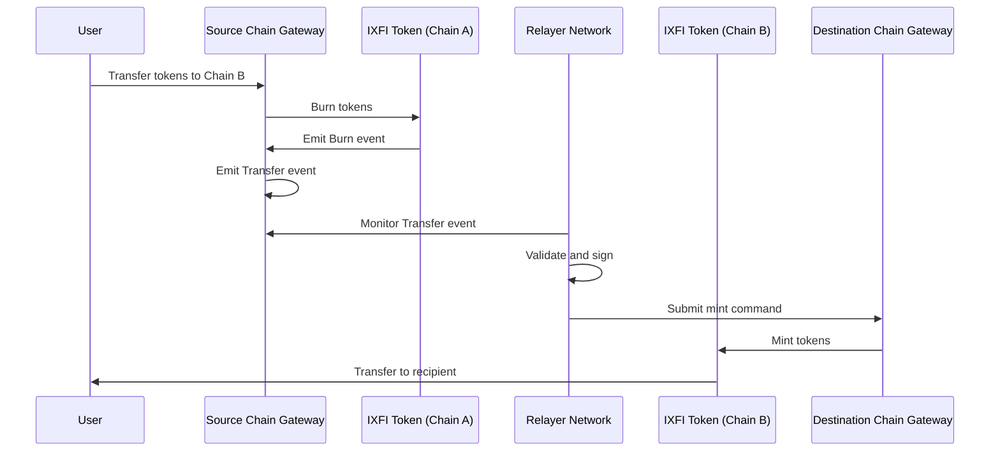
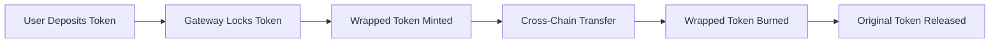

# Token Transfers

IXFI Protocol enables seamless token transfers across multiple blockchain networks through a secure burn-and-mint mechanism powered by a decentralized relayer network.

## Overview

Cross-chain token transfers allow users to move IXFI tokens and other supported assets between different blockchains while maintaining security and decentralization principles.

## Transfer Mechanism

### Burn-and-Mint Model



### Lock-and-Release Model (For Native Tokens)

For non-IXFI tokens, the protocol uses a lock-and-release mechanism:



## Implementation

### Basic Token Transfer

```solidity
interface IIXFIGateway {
    function sendToken(
        string memory destinationChain,
        string memory destinationAddress,
        string memory symbol,
        uint256 amount
    ) external;
}
```

### Example Usage

```solidity
contract TokenBridge {
    IIXFIGateway public gateway;
    IERC20 public ixfiToken;
    
    function transferToChain(
        string memory targetChain,
        string memory recipient,
        uint256 amount
    ) external {
        // Transfer tokens to gateway
        ixfiToken.transferFrom(msg.sender, address(gateway), amount);
        
        // Initiate cross-chain transfer
        gateway.sendToken(
            targetChain,
            recipient,
            "IXFI",
            amount
        );
    }
}
```

### Advanced Transfer with Data

```solidity
function sendTokenWithData(
    string memory destinationChain,
    string memory destinationAddress,
    string memory symbol,
    uint256 amount,
    bytes memory data
) external {
    // Transfer tokens and execute contract call
    gateway.callContractWithToken(
        destinationChain,
        destinationAddress,
        data,
        symbol,
        amount
    );
}
```

## Supported Tokens

### Native IXFI Token

| Chain | Contract Address | Decimals | Type |
|-------|-----------------|----------|------|
| CrossFi | `0x...` | 18 | Native |
| Ethereum | `0x...` | 18 | Wrapped |
| BSC | `0x...` | 18 | Wrapped |
| Polygon | `0x...` | 18 | Wrapped |
| Arbitrum | `0x...` | 18 | Wrapped |
| Optimism | `0x...` | 18 | Wrapped |
| Avalanche | `0x...` | 18 | Wrapped |

### Wrapped Tokens

The protocol supports wrapping of various tokens for cross-chain transfers:

```solidity
struct WrappedToken {
    string symbol;
    uint8 decimals;
    mapping(string => address) chainAddresses;
    bool isActive;
}

mapping(string => WrappedToken) public wrappedTokens;
```

## Transfer Types

### 1. Simple Transfer

Direct token transfer between addresses on different chains:

```javascript
// Transfer 100 IXFI from Ethereum to BSC
await gateway.sendToken(
    "bsc",                    // destination chain
    "0x742d35Cc6aB8C...",    // recipient address
    "IXFI",                  // token symbol
    ethers.parseEther("100") // amount
);
```

### 2. Transfer with Contract Call

Transfer tokens and execute a function on the destination chain:

```javascript
// Transfer tokens and stake them on destination chain
const stakePayload = ethers.AbiCoder.defaultAbiCoder().encode(
    ["address", "uint256"],
    [userAddress, stakingPeriod]
);

await gateway.callContractWithToken(
    "polygon",               // destination chain
    stakingContractAddress,  // staking contract
    stakePayload,           // function call data
    "IXFI",                 // token symbol
    ethers.parseEther("500") // amount to stake
);
```

### 3. Batch Transfers

Transfer multiple tokens in a single transaction:

```solidity
struct TokenTransfer {
    string destinationChain;
    string destinationAddress;
    string symbol;
    uint256 amount;
}

function batchTransfer(TokenTransfer[] memory transfers) external {
    for (uint256 i = 0; i < transfers.length; i++) {
        sendToken(
            transfers[i].destinationChain,
            transfers[i].destinationAddress,
            transfers[i].symbol,
            transfers[i].amount
        );
    }
}
```

## Security Features

### Multi-Signature Validation

All token transfers require validation from multiple relayers:

```solidity
struct MintCommand {
    bytes32 commandId;
    string sourceChain;
    address recipient;
    uint256 amount;
    bytes32[] signatures;
}

function validateMintCommand(MintCommand memory cmd) internal view returns (bool) {
    require(cmd.signatures.length >= minSignatures, "Insufficient signatures");
    
    bytes32 hash = keccak256(abi.encode(cmd.commandId, cmd.sourceChain, cmd.recipient, cmd.amount));
    
    uint256 validSignatures = 0;
    for (uint256 i = 0; i < cmd.signatures.length; i++) {
        if (_verifyRelayerSignature(hash, cmd.signatures[i])) {
            validSignatures++;
        }
    }
    
    return validSignatures >= minSignatures;
}
```

### Rate Limiting

Transfer limits prevent large-scale attacks:

```solidity
mapping(address => uint256) public dailyTransferred;
mapping(address => uint256) public lastTransferDay;

uint256 public dailyLimit = 10000 ether;

modifier rateLimited(uint256 amount) {
    uint256 today = block.timestamp / 1 days;
    
    if (lastTransferDay[msg.sender] < today) {
        dailyTransferred[msg.sender] = 0;
        lastTransferDay[msg.sender] = today;
    }
    
    require(
        dailyTransferred[msg.sender] + amount <= dailyLimit,
        "Daily limit exceeded"
    );
    
    dailyTransferred[msg.sender] += amount;
    _;
}
```

### Replay Protection

Command IDs prevent duplicate token minting:

```solidity
mapping(bytes32 => bool) public executedCommands;

function mint(
    bytes32 commandId,
    address recipient,
    uint256 amount
) external onlyRelayer {
    require(!executedCommands[commandId], "Command already executed");
    executedCommands[commandId] = true;
    
    _mint(recipient, amount);
}
```

## Fee Structure

### Transfer Fees

```solidity
struct TransferFees {
    uint256 baseFee;          // Fixed fee per transfer
    uint256 percentageFee;    // Percentage of transfer amount
    uint256 gasReimbursement; // Estimated gas cost
}

mapping(string => TransferFees) public chainFees;
```

### Fee Calculation

```solidity
function calculateTransferFee(
    string memory destinationChain,
    uint256 amount
) public view returns (uint256) {
    TransferFees memory fees = chainFees[destinationChain];
    
    uint256 percentageFee = (amount * fees.percentageFee) / 10000;
    return fees.baseFee + percentageFee + fees.gasReimbursement;
}
```

### Fee Payment Options

1. **Native Token**: Pay fees in the source chain's native token
2. **IXFI Token**: Pay fees using IXFI tokens
3. **Deducted from Transfer**: Fees deducted from transfer amount

## Gas Management

### Gas Estimation

```solidity
function estimateTransferGas(
    string memory destinationChain,
    string memory symbol,
    uint256 amount
) external view returns (uint256) {
    // Base gas for token minting
    uint256 baseGas = 50000;
    
    // Additional gas for complex tokens
    if (wrappedTokens[symbol].isActive) {
        baseGas += 30000;
    }
    
    // Chain-specific gas adjustments
    uint256 chainMultiplier = chainGasMultipliers[destinationChain];
    return (baseGas * chainMultiplier) / 100;
}
```

### Gas Payment Models

#### Prepaid Gas

```solidity
function transferWithGas(
    string memory destinationChain,
    string memory destinationAddress,
    string memory symbol,
    uint256 amount,
    uint256 gasLimit
) external payable {
    uint256 gasCost = calculateGasCost(destinationChain, gasLimit);
    require(msg.value >= gasCost, "Insufficient gas payment");
    
    // Process transfer with guaranteed gas
    _sendTokenWithGas(destinationChain, destinationAddress, symbol, amount, gasLimit);
}
```

#### Token-Based Gas

```solidity
function transferWithTokenGas(
    string memory destinationChain,
    string memory destinationAddress,
    string memory symbol,
    uint256 amount,
    uint256 gasTokenAmount
) external {
    // Deduct gas tokens
    ixfiToken.transferFrom(msg.sender, gasVault, gasTokenAmount);
    
    // Process transfer
    sendToken(destinationChain, destinationAddress, symbol, amount);
}
```

## Error Handling

### Transfer Failures

```solidity
event TransferFailed(
    bytes32 indexed transferId,
    string reason,
    bool canRetry
);

function retryTransfer(bytes32 transferId) external {
    TransferData memory transfer = failedTransfers[transferId];
    require(transfer.canRetry, "Transfer cannot be retried");
    require(block.timestamp >= transfer.retryAfter, "Too early to retry");
    
    // Retry the transfer
    _executeTransfer(transfer);
}
```

### Automatic Rollback

```solidity
function rollbackTransfer(bytes32 transferId) external onlyRelayer {
    TransferData memory transfer = pendingTransfers[transferId];
    require(transfer.deadline < block.timestamp, "Transfer not expired");
    
    // Mint tokens back to original sender
    _mint(transfer.sender, transfer.amount);
    
    emit TransferRolledBack(transferId, transfer.sender, transfer.amount);
}
```

## Advanced Features

### Scheduled Transfers

```solidity
struct ScheduledTransfer {
    address sender;
    string destinationChain;
    string destinationAddress;
    string symbol;
    uint256 amount;
    uint256 executeAt;
    bool executed;
}

mapping(bytes32 => ScheduledTransfer) public scheduledTransfers;

function scheduleTransfer(
    string memory destinationChain,
    string memory destinationAddress,
    string memory symbol,
    uint256 amount,
    uint256 executeAt
) external returns (bytes32) {
    require(executeAt > block.timestamp, "Invalid execution time");
    
    bytes32 transferId = keccak256(abi.encode(
        msg.sender,
        destinationChain,
        destinationAddress,
        symbol,
        amount,
        executeAt,
        block.number
    ));
    
    scheduledTransfers[transferId] = ScheduledTransfer({
        sender: msg.sender,
        destinationChain: destinationChain,
        destinationAddress: destinationAddress,
        symbol: symbol,
        amount: amount,
        executeAt: executeAt,
        executed: false
    });
    
    return transferId;
}
```

### Conditional Transfers

```solidity
function transferOnCondition(
    string memory destinationChain,
    string memory destinationAddress,
    string memory symbol,
    uint256 amount,
    bytes memory condition
) external {
    bytes32 transferId = _generateTransferId();
    
    conditionalTransfers[transferId] = ConditionalTransfer({
        sender: msg.sender,
        destinationChain: destinationChain,
        destinationAddress: destinationAddress,
        symbol: symbol,
        amount: amount,
        condition: condition,
        validated: false
    });
    
    // Lock tokens until condition is met
    _lockTokens(msg.sender, symbol, amount);
}
```

## Monitoring and Analytics

### Transfer Tracking

```solidity
event TokenTransferInitiated(
    bytes32 indexed transferId,
    address indexed sender,
    string indexed destinationChain,
    string destinationAddress,
    string symbol,
    uint256 amount
);

event TokenTransferCompleted(
    bytes32 indexed transferId,
    string indexed sourceChain,
    address indexed recipient,
    string symbol,
    uint256 amount
);
```

### Transfer Status

```solidity
enum TransferStatus {
    PENDING,
    PROCESSING,
    COMPLETED,
    FAILED,
    CANCELLED
}

function getTransferStatus(bytes32 transferId) external view returns (TransferStatus) {
    return transferStatuses[transferId];
}
```

## Integration Examples

### DeFi Integration

```solidity
contract CrossChainYieldFarm {
    function depositAcrossChains(
        string memory sourceChain,
        uint256 amount
    ) external {
        bytes memory depositData = abi.encodeWithSignature(
            "deposit(address,uint256)",
            msg.sender,
            amount
        );
        
        gateway.callContractWithToken(
            sourceChain,
            address(this),
            depositData,
            "IXFI",
            amount
        );
    }
    
    function executeWithToken(
        bytes32,
        string memory,
        string memory,
        bytes memory payload,
        string memory,
        uint256 amount
    ) external override onlyGateway {
        (address user, uint256 depositAmount) = abi.decode(
            payload,
            (address, uint256)
        );
        
        require(amount == depositAmount, "Amount mismatch");
        _deposit(user, amount);
    }
}
```

### Gaming Integration

```solidity
contract CrossChainGameAssets {
    function transferAssetToChain(
        uint256 assetId,
        string memory targetChain,
        address newOwner
    ) external {
        require(ownerOf(assetId) == msg.sender, "Not asset owner");
        
        // Burn asset on current chain
        _burn(assetId);
        
        bytes memory mintData = abi.encodeWithSignature(
            "mintAsset(address,uint256)",
            newOwner,
            assetId
        );
        
        gateway.callContract(targetChain, address(this), mintData);
    }
}
```

## Best Practices

### For Users

1. **Verify Addresses**: Double-check destination addresses and chains
2. **Check Fees**: Understand fee structure before transferring
3. **Monitor Status**: Track transfer status until completion
4. **Use Proper Gas**: Provide adequate gas for complex transfers

### For Developers

1. **Implement Timeouts**: Set reasonable timeouts for transfers
2. **Handle Failures**: Implement proper error handling and recovery
3. **Test Thoroughly**: Test transfers on all supported chains
4. **Monitor Events**: Listen for transfer events and status updates

### Security Guidelines

1. **Validate Inputs**: Always validate transfer parameters
2. **Rate Limiting**: Implement appropriate rate limiting
3. **Access Control**: Restrict sensitive functions properly
4. **Audit Regularly**: Regular security audits for transfer logic

## Resources

- [Cross-Chain Architecture](../core-concepts/cross-chain-architecture.md)
- [Message Passing](message-passing.md)
- [IXFI Token Details](../core-concepts/ixfi-token.md)
- [Integration Examples](../examples/cross-chain-swap.md)
