# DEX Aggregation Overview

IXFI Protocol includes one of the most comprehensive DEX aggregation systems in DeFi, supporting 37+ protocols across 7 blockchain networks for optimal trading execution.

## Why DEX Aggregation?

### The Fragmentation Problem

Modern DeFi spans multiple chains and hundreds of DEX protocols, each with:
- Different liquidity pools
- Varying fee structures  
- Unique token pairs
- Inconsistent pricing

**Without aggregation, users face:**
- ❌ Manual comparison across multiple DEXes
- ❌ Suboptimal pricing due to limited liquidity
- ❌ High gas costs from multiple transactions
- ❌ Complex cross-chain operations

**With IXFI aggregation:**
- ✅ Automatic best price discovery
- ✅ Single transaction execution
- ✅ Cross-chain routing optimization
- ✅ Unified interface across all protocols

## Architecture Overview


## Supported DEX Categories

### V2 AMM Protocols

Traditional Automated Market Makers using the constant product formula (x*y=k):

**Major Protocols:**
- **Uniswap V2** - Original AMM standard
- **SushiSwap V2** - Community-driven fork
- **PancakeSwap V2** - BSC's leading DEX
- **QuickSwap** - Polygon's fastest DEX
- **TraderJoe V1** - Avalanche's premier DEX

**Characteristics:**
- ✅ Simple pricing model
- ✅ High liquidity for major pairs
- ✅ Proven security track record
- ❌ Capital inefficiency
- ❌ Impermanent loss for LPs

### V3 Concentrated Liquidity

Advanced AMMs with concentrated liquidity positions:

**Leading Protocols:**
- **Uniswap V3** - Concentrated liquidity pioneer
- **SushiSwap V3** - Enhanced V3 implementation
- **PancakeSwap V3** - BSC concentrated liquidity

**Advantages:**
- ✅ Capital efficiency (up to 4000x)
- ✅ Custom fee tiers
- ✅ Active liquidity management
- ✅ Better pricing for large trades
- ❌ Complexity for liquidity providers
- ❌ Impermanent loss amplification

**Fee Tiers:**
- **0.01%** (100): Stablecoin pairs
- **0.05%** (500): Stable pairs with some volatility
- **0.30%** (3000): Most pairs
- **1.00%** (10000): Exotic pairs

### Solidly Forks (ve(3,3))

Protocols based on Andre Cronje's Solidly design:

**Key Protocols:**
- **Velodrome** (Optimism) - Leading ve(3,3) protocol
- **Aerodrome** (Base) - Coinbase L2 implementation
- **Thena** (BSC) - Multi-chain ve(3,3)
- **Ramses** (Arbitrum) - Arbitrum's ve(3,3) protocol

**Features:**
- ✅ Dual pool types (volatile + stable)
- ✅ Emissions voting mechanism
- ✅ Protocol-owned liquidity
- ✅ Reduced impermanent loss for stable pairs

### Stableswap Protocols

Specialized AMMs optimized for correlated assets:

**Major Protocols:**
- **Curve Finance** - Stablecoin trading pioneer
- **Ellipsis Finance** - BSC's Curve implementation
- **Belt Finance** - Multi-asset yield farming

**Optimizations:**
- ✅ Minimal slippage for stable pairs
- ✅ Capital efficiency for correlated assets
- ✅ Yield farming integration
- ✅ Metapool support

### Specialized Protocols

Unique DEX designs with specific use cases:

**Notable Protocols:**
- **Balancer V2** - Multi-asset weighted pools
- **1inch** - Meta-aggregation protocol
- **DODO** - Proactive Market Maker (PMM)
- **WooFi** - Synthetic proactive market making
- **Platypus** - Single-sided stablecoin AMM

## Routing Algorithm

### Multi-Hop Routing

IXFI's routing algorithm finds optimal paths across multiple protocols:


### Route Optimization

**Factors Considered:**
1. **Price Impact** - Slippage minimization
2. **Gas Costs** - Transaction fee optimization
3. **Liquidity Depth** - Available token reserves
4. **Protocol Fees** - DEX-specific charges
5. **Split Routing** - Distributing trades across multiple paths

**Algorithm Steps:**
1. **Quote Generation** - Get prices from all 37 protocols
2. **Path Discovery** - Find viable multi-hop routes
3. **Split Optimization** - Determine optimal trade distribution
4. **Gas Estimation** - Calculate execution costs
5. **Best Route Selection** - Maximize net output

### Smart Routing Features

**Split Routing:**
```javascript
// Example: $10,000 USDC → WETH split across protocols
{
  "totalAmountIn": "10000000000", // 10,000 USDC
  "routes": [
    {
      "protocol": "Uniswap V3",
      "percentage": 45,
      "amountIn": "4500000000",
      "expectedOut": "1.234 ETH"
    },
    {
      "protocol": "SushiSwap V2", 
      "percentage": 35,
      "amountIn": "3500000000",
      "expectedOut": "0.956 ETH"
    },
    {
      "protocol": "Curve",
      "percentage": 20,
      "amountIn": "2000000000", 
      "expectedOut": "0.543 ETH"
    }
  ],
  "totalExpectedOut": "2.733 ETH",
  "priceImpact": "0.12%",
  "gasEstimate": "450000"
}
```

## Quote System

### Real-Time Price Discovery

The quote system provides instant price comparisons across all supported protocols:

**Quote Sources:**
- **On-chain calls** to DEX contracts
- **Subgraph queries** for historical data
- **Price oracles** for validation
- **Mempool analysis** for MEV protection

### Quote Comparison

```javascript
async function compareQuotes(tokenIn, tokenOut, amountIn) {
  const quotes = await aggregator.getAllQuotes(tokenIn, tokenOut, amountIn);
  
  return quotes.map(quote => ({
    protocol: getDEXName(quote.routerType),
    amountOut: quote.amountOut,
    priceImpact: calculatePriceImpact(quote),
    gasEstimate: quote.gasEstimate,
    netOutput: quote.amountOut.sub(quote.gasEstimate)
  })).sort((a, b) => b.netOutput.sub(a.netOutput));
}
```

### Dynamic Updates

**Quote Refresh Strategy:**
- **Block-based updates** for high-frequency pairs
- **Time-based refresh** for standard pairs
- **Event-driven updates** for liquidity changes
- **User-triggered refresh** for manual updates

## Cross-Chain Aggregation

### Cross-Chain Swap Flow

```mermaid
sequenceDiagram
    participant User
    participant Aggregator_A as Aggregator (Chain A)
    participant IXFI_A as IXFI Gateway (Chain A) 
    participant Relayer
    participant IXFI_B as IXFI Gateway (Chain B)
    participant Aggregator_B as Aggregator (Chain B)
    
    User->>Aggregator_A: Swap Token A → Token B (cross-chain)
    Aggregator_A->>Aggregator_A: Find best route A → IXFI
    Aggregator_A->>IXFI_A: Execute swap A → IXFI
    IXFI_A->>Relayer: Bridge IXFI to Chain B
    Relayer->>IXFI_B: Deliver IXFI + swap instructions
    IXFI_B->>Aggregator_B: Execute swap IXFI → Token B
    Aggregator_B->>User: Deliver Token B
```



### Cross-Chain Route Optimization

**Considerations:**
- **Bridge costs** and timing
- **Destination chain liquidity**
- **Gas price differences**
- **MEV protection across chains**

## Performance Metrics

### Speed Benchmarks

| Operation | Response Time | Success Rate |
|-----------|---------------|--------------|
| Single quote | <100ms | 99.9% |
| All quotes (37 DEXes) | <500ms | 99.5% |
| Route optimization | <200ms | 99.8% |
| Cross-chain quote | <2s | 99.0% |

### Cost Savings

**Gas Optimization:**
- **Batch operations**: 40-60% gas savings
- **Route optimization**: 15-30% price improvement
- **MEV protection**: 2-5% value preservation

**Comparison vs Direct DEX:**
```
Direct Uniswap V2:     1.245 ETH (gas: $25)
IXFI Aggregated:       1.287 ETH (gas: $18)
Improvement:           +3.4% tokens, -28% gas
```

## Integration Examples

### Basic Swap

```javascript
import { CrossChainAggregator } from '@ixfi/sdk';

async function performAggregatedSwap() {
  const aggregator = new CrossChainAggregator({ network: 'mainnet' });
  
  // Get optimal route
  const quote = await aggregator.getOptimalQuote(
    '0xA0b86a33E6441e1a02c4e4670dd96EA0f25A632', // USDC
    '0xC02aaA39b223FE8D0A0e5C4F27eAD9083C756Cc2', // WETH
    ethers.utils.parseUnits('1000', 6) // 1000 USDC
  );
  
  console.log(`Best price: ${quote.bestAmount} WETH`);
  console.log(`From: ${quote.dexName}`);
  console.log(`Price impact: ${quote.priceImpact}%`);
  
  // Execute swap
  const tx = await aggregator.executeSwap({
    tokenIn: '0xA0b86a33E6441e1a02c4e4670dd96EA0f25A632',
    tokenOut: '0xC02aaA39b223FE8D0A0e5C4F27eAD9083C756Cc2',
    amountIn: ethers.utils.parseUnits('1000', 6),
    minAmountOut: quote.bestAmount.mul(995).div(1000), // 0.5% slippage
    routerType: quote.bestRouter
  });
  
  return tx;
}
```

### Advanced Multi-Route

```javascript
async function advancedRouting() {
  // Compare specific protocols only
  const preferredDEXes = [
    0,  // Uniswap V2
    10, // Uniswap V3  
    1,  // SushiSwap V2
    11, // SushiSwap V3
    30  // Curve
  ];
  
  const quotes = await aggregator.getQuotesForRouters(
    tokenIn,
    tokenOut, 
    amountIn,
    preferredDEXes
  );
  
  // Custom selection logic
  const bestQuote = quotes.find(q => 
    q.priceImpact < 0.5 && // Max 0.5% price impact
    q.gasEstimate < ethers.utils.parseUnits('200', 'gwei') // Reasonable gas
  ) || quotes[0]; // Fallback to best price
  
  return aggregator.executeSwap({
    ...swapParams,
    routerType: bestQuote.routerType
  });
}
```

## Security Considerations

### MEV Protection

**Protection Mechanisms:**
- **Private mempool submission**
- **Flashloan sandwich detection**
- **Price impact monitoring**
- **Revert on unexpected slippage**

### Smart Contract Security

**Risk Mitigation:**
- **Router contract verification**
- **Slippage protection enforcement**
- **Deadline validation**
- **Reentrancy guards**

### Oracle Reliability

**Price Validation:**
- **Multiple price sources**
- **Deviation thresholds**
- **Circuit breakers**
- **Manual override capabilities**

## Future Enhancements

### Planned Features

**Q1 2024:**
- ✅ Intent-based routing
- ✅ Just-in-time liquidity
- ✅ Cross-chain MEV protection

**Q2 2024:**
- 🔄 Solver network integration
- 🔄 Advanced order types
- 🔄 Portfolio rebalancing

**Q3 2024:**
- 📋 Options protocol integration
- 📋 Lending market routing
- 📋 Yield farming optimization

### Research Areas

- **Machine learning** for price prediction
- **Game theory** for MEV mitigation
- **ZK proofs** for privacy-preserving routing
- **Intent-based architecture** for user experience

## Next Steps

Learn more about specific aspects:

1. **[Supported DEXes](supported-dexes.md)** - Complete protocol list
2. **[Routing Algorithm](routing-algorithm.md)** - Technical deep dive
3. **[Quote System](quote-system.md)** - Price discovery mechanics
4. **[Router Types](router-types.md)** - Protocol categorization

Ready to integrate? Check out our [Integration Examples](../examples/dex-aggregation.md)!
