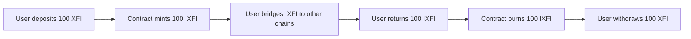

# Frequently Asked Questions

## General Questions

### What is IXFI Protocol?

IXFI is a cross-chain infrastructure protocol that enables seamless token transfers, DEX aggregation, and gasless transactions across multiple blockchain networks. It uses a 1:1 XFI-backed token system and supports 37+ DEX protocols across 7 chains.

### How does IXFI differ from other cross-chain protocols?

**Key Differentiators:**
- ✅ **DEX Aggregation**: Built-in support for 37+ DEX protocols
- ✅ **Gasless Transactions**: IXFI-based gas credit system
- ✅ **1:1 Backing**: Fully collateralized by native XFI tokens
- ✅ **Unified Interface**: Single SDK for all supported chains
- ✅ **MEV Protection**: Advanced routing algorithms

### Which networks does IXFI support?

**Currently Supported:**
- Ethereum (Chain ID: 1)
- BSC (Chain ID: 56)
- Polygon (Chain ID: 137)
- Avalanche (Chain ID: 43114)
- Arbitrum (Chain ID: 42161)
- Optimism (Chain ID: 10)
- Base (Chain ID: 8453)

**Coming Soon:**
- Solana
- Cosmos ecosystem
- Additional EVM chains

### Is IXFI safe to use?

**Security Measures:**
- ✅ Multiple security audits
- ✅ Formal verification for critical functions
- ✅ Bug bounty program
- ✅ Gradual deployment strategy
- ✅ Emergency pause mechanisms
- ✅ Decentralized relayer network

---

## Technical Questions

### How does the 1:1 XFI backing work?

IXFI tokens are minted when users deposit native XFI on the CrossFi chain and burned when they withdraw. This ensures:

- **Full Collateralization**: Every IXFI token is backed by 1 XFI
- **Transparency**: All reserves are verifiable on-chain
- **Stability**: No inflation or arbitrary token creation
- **Redemption**: Always redeemable for underlying XFI



### What DEX protocols are supported?

**V2 AMM Protocols (Traditional):**
- Uniswap V2, SushiSwap V2, PancakeSwap V2, QuickSwap, TraderJoe V1

**V3 Concentrated Liquidity:**
- Uniswap V3, SushiSwap V3, PancakeSwap V3, Algebra

**Solidly Forks (ve(3,3)):**
- Velodrome (Optimism), Aerodrome (Base), Thena (BSC), Ramses (Arbitrum)

**Stableswap Protocols:**
- Curve Finance, Ellipsis Finance, Belt Finance

**Specialized DEXes:**
- Balancer V2, 1inch, DODO, WooFi, Platypus

*See [Supported DEXes](../dex-aggregation/supported-dexes.md) for complete list.*

### How does cross-chain routing work?

Cross-chain swaps follow this pattern:

1. **Source Chain**: Token A → IXFI (using best DEX)
2. **Bridge**: IXFI transferred via relayer network
3. **Destination Chain**: IXFI → Token B (using best DEX)


sequenceDiagram
    participant User
    participant Aggregator_A as Source Chain
    participant Relayer
    participant Aggregator_B as Destination Chain
    
    User->>Aggregator_A: Swap USDC → BNB (cross-chain)
    Aggregator_A->>Aggregator_A: USDC → IXFI (Uniswap)
    Aggregator_A->>Relayer: Bridge IXFI
    Relayer->>Aggregator_B: Deliver IXFI
    Aggregator_B->>Aggregator_B: IXFI → BNB (PancakeSwap)
    Aggregator_B->>User: Deliver BNB


### How are gas fees handled?

**Regular Transactions:**
- Users pay gas in native tokens (ETH, BNB, MATIC, etc.)
- Gas optimization through batch operations

**Gasless Transactions:**
- Users pre-deposit IXFI tokens as gas credits
- Relayers pay gas and deduct from credits
- Dynamic pricing based on network conditions

### What about MEV protection?

**Protection Mechanisms:**
- Private mempool submission through relayers
- Sandwich attack detection and prevention
- Price impact monitoring and circuit breakers
- Optimal routing to minimize extractable value

---

## Usage Questions

### How do I get started with IXFI?

1. **Install the SDK**: `npm install @ixfi/sdk`
2. **Initialize Provider**: Connect to your Web3 wallet
3. **Configure Networks**: Set up supported chains
4. **Start Trading**: Use aggregated swaps

See our [Quick Start Guide](../getting-started/quick-start.md) for detailed steps.

### How do I perform a token swap?

**Basic Swap (Same Chain):**
```javascript
const quote = await aggregator.getOptimalQuote(tokenIn, tokenOut, amountIn);
const tx = await aggregator.executeSwap({
  tokenIn,
  tokenOut,
  amountIn,
  minAmountOut: quote.bestAmount * 0.995, // 0.5% slippage
  routerType: quote.bestRouter
});
```

**Cross-Chain Swap:**
```javascript
const tx = await ixfi.crossChainSwap({
  sourceChain: 'ethereum',
  destinationChain: 'bsc',
  tokenIn: USDC_ADDRESS,
  tokenOut: BNB_ADDRESS,
  amountIn: ethers.utils.parseUnits('100', 6),
  slippage: 50 // 0.5%
});
```

### How do I enable gasless transactions?

1. **Deposit Gas Credits:**
```javascript
await ixfi.depositGasCredits(ethers.utils.parseEther('10')); // 10 IXFI
```

2. **Check Balance:**
```javascript
const balance = await ixfi.getGasCredits();
console.log(`Credits: $${balance.balance}`);
```

3. **Execute Gasless Transaction:**
```javascript
await ixfi.executeGaslessTransaction({
  to: contractAddress,
  data: encodedFunctionCall,
  value: '0'
});
```

### How long do cross-chain operations take?

**Typical Times:**
- **Ethereum ↔ BSC**: 2-3 minutes
- **Ethereum ↔ Polygon**: 3-5 minutes
- **BSC ↔ Polygon**: 2-4 minutes
- **L2 networks**: 1-2 minutes

**Factors Affecting Speed:**
- Network congestion
- Number of block confirmations required
- Relayer response time
- Destination chain gas prices

### What are the fees?

**Cross-Chain Operations:**
- Bridge fee: 0.1% of transferred amount
- Relayer fee: Dynamic based on gas costs
- Protocol fee: 0.05% to treasury

**DEX Aggregation:**
- Routing fee: 0.05% on optimal path
- Gas savings typically offset fees
- No fee for quote comparisons

**Meta-Transactions:**
- Gas cost + 10% relayer premium
- Paid in IXFI tokens
- Dynamic pricing based on congestion

---

## Troubleshooting

### My transaction failed. What happened?

**Common Causes:**
1. **Slippage Exceeded**: Price moved unfavorably
2. **Expired Deadline**: Transaction took too long
3. **Insufficient Balance**: Not enough tokens/gas
4. **Network Congestion**: High gas prices
5. **Router Issues**: DEX protocol temporarily unavailable

**Solutions:**
- Increase slippage tolerance
- Use longer deadlines
- Check token balances
- Retry during lower congestion
- Try different DEX protocols

### Why is my cross-chain swap taking so long?

**Potential Issues:**
- Network congestion on source/destination chains
- Relayer temporarily offline
- Insufficient confirmations
- High gas prices causing delays

**Check Status:**
```javascript
const status = await ixfi.getCrossChainStatus(txHash);
console.log(`Status: ${status.stage}`); // 'pending', 'bridging', 'completing', 'completed'
```

### Gasless transactions aren't working?

**Checklist:**
1. ✅ Sufficient gas credits deposited
2. ✅ Valid signature format (EIP-712)
3. ✅ Relayer service operational
4. ✅ Transaction within gas limits
5. ✅ Correct nonce usage

### I'm getting "Router call failed" errors?

**Debugging Steps:**
1. Verify token approvals
2. Check router contract addresses
3. Validate swap parameters
4. Test with smaller amounts
5. Try alternative router types

---

## Development Questions

### How do I integrate IXFI into my DApp?

**Frontend Integration:**
```javascript
import { IXFIProvider, CrossChainAggregator } from '@ixfi/sdk';

const ixfi = new IXFIProvider({
  network: 'mainnet',
  provider: window.ethereum
});
```

**Smart Contract Integration:**
```solidity
import "./IXFIExecutable.sol";

contract MyDApp is IXFIExecutable {
  constructor(address gateway) IXFIExecutable(gateway) {}
  
  function _execute(string calldata sourceChain, string calldata sourceAddress, bytes calldata payload) internal override {
    // Handle cross-chain messages
  }
}
```

### Are there testnet deployments?

**Testnet Addresses:**
- Sepolia: `0x...`
- BSC Testnet: `0x...`
- Mumbai (Polygon): `0x...`
- Fuji (Avalanche): `0x...`

*See [Configuration Guide](../getting-started/configuration.md) for complete addresses.*

### How do I run local tests?

```bash
# Clone repository
git clone https://github.com/DINetworks/IXFI-Contracts.git

# Install dependencies
npm install

# Run tests
npx hardhat test

# Run with forking
FORKING=true npx hardhat test
```

### Can I add support for new DEX protocols?

Yes! IXFI is designed to be extensible:

1. **Implement Quote Function** in QuoteLibrary
2. **Add Router Configuration** in deployment scripts
3. **Test Integration** thoroughly
4. **Submit Pull Request** with documentation

See [Contributing Guide](contributing.md) for details.

---

## Economics & Governance

### How is IXFI governed?

**Current Phase**: Foundation governance with community input
**Future Phase**: Token-based DAO governance

**Governance Scope:**
- Protocol parameter updates
- New chain integrations
- Emergency responses
- Treasury management

### What's the business model?

**Revenue Sources:**
- Cross-chain bridge fees (0.1%)
- DEX aggregation fees (0.05%)
- Meta-transaction premiums (10%)
- Protocol-owned liquidity returns

**Value Accrual:**
- Fee sharing with token holders (future)
- Treasury diversification
- Ecosystem development funding

### Is there a token distribution/airdrop?

IXFI tokens are only created through XFI deposits - there is no pre-mining, ICO, or traditional token distribution. Tokens are earned by:

- Providing liquidity to XFI/IXFI pools
- Participating in governance (future)
- Using the protocol (potential rewards)
- Contributing to development

---

## Getting Help

### Where can I get support?

**Community:**
- 💬 [Discord](https://discord.gg/ixfi) - Real-time chat
- 🐦 [Twitter](https://twitter.com/IXFIProtocol) - Updates and announcements
- 📖 [Documentation](/) - Comprehensive guides

**Technical:**
- 🐛 [GitHub Issues](https://github.com/DINetworks/IXFI-Contracts/issues) - Bug reports
- 📧 [Email Support](mailto:support@ixfi.com) - Direct assistance
- 💻 [Developer Portal](https://developers.ixfi.com) - Technical resources

### How do I report bugs or suggest features?

1. **Check Existing Issues** on GitHub
2. **Use Templates** for bug reports or feature requests
3. **Provide Details**: Network, transaction hashes, error messages
4. **Include Screenshots** if relevant

### Can I contribute to the project?

Absolutely! We welcome contributions:

- **Code**: Smart contracts, SDK improvements, bug fixes
- **Documentation**: Guides, examples, translations
- **Testing**: QA, security reviews, integration testing
- **Community**: Support, content creation, evangelism

See [Contributing Guide](contributing.md) for how to get started.

---

*Don't see your question? Join our [Discord](https://discord.gg/ixfi) or [create an issue](https://github.com/DINetworks/IXFI-Contracts/issues) on GitHub!*
